# PathForge v2 Aggregate Design & Consistency Boundaries

> **Author:** Principal Domain-Driven Design Architect
> **Date:** 2026-06-24
> **Status:** Approved

---

## Table of Contents

1. [Executive Summary](#executive-summary)
2. [Aggregate Review Methodology](#aggregate-review-methodology)
3. [Aggregate-by-Aggregate Analysis](#aggregate-by-aggregate-analysis)
4. [Final Aggregate Map](#final-aggregate-map)
5. [Refactored Class Diagram](#refactored-class-diagram)
6. [Ownership Hierarchy](#ownership-hierarchy)
7. [Consistency Boundaries](#consistency-boundaries)
8. [Skill Domain Redesign](#skill-domain-redesign)
9. [Application Pipeline Redesign](#application-pipeline-redesign)
10. [PostgreSQL Schema Design](#postgresql-schema-design)
11. [NestJS Implementation Patterns](#nestjs-implementation-patterns)
12. [Migration Guide](#migration-guide)

---

## Executive Summary

### v2 Problems Identified

The previous v2 model had 18 aggregate roots — far too many for a domain of this complexity. This fragmentation creates unnecessary transactional boundaries, hurts query performance, and forces eventual consistency where strong consistency is natural.

| Problem | Consequence |
|---------|-------------|
| 18 aggregate roots | Developers must coordinate across 18 transactional boundaries |
| CareerProfile as root | Extra repository, no independent lifecycle |
| Achievement as root | No business rules, no lifecycle — a record, not a root |
| Badge as root | Same as Achievement — a record |
| PortfolioProject as root | Weak business logic, limited quantity |
| Interview as root | Mock interviews without applications create orphaned data |
| Offer as root | Never exists without an Application |
| Negotiation as root | Weaker consistency with Offer terms |
| Skill as root (with userId) | Duplicate skill definitions, bloated references |
| Notification as root | Vanity aggregate — no business rules |

### Target: 8 Aggregate Roots

After rigorous analysis, the domain resolves to **8 true aggregate roots**:

| # | Aggregate | Owns | Why Root |
|---|-----------|------|----------|
| 1 | User | CareerProfile, UserSkills, Achievements, Badges, PortfolioProjects | Identity root of the system |
| 2 | Subscription | — | Independent billing lifecycle, Stripe integration |
| 3 | Goal | Milestones | Career objectives with progress tracking |
| 4 | LearningPlan | LearningItems | Structured learning with item-level tracking |
| 5 | Job | — | Reusable position definition, market intelligence |
| 6 | Application | Interviews, Offers | Pipeline consistency — interviews and offers cannot exist independently |
| 7 | Negotiation | — | References Offer by ID, distinct extended lifecycle |
| 8 | Resume | ResumeSections | Versioned documents with ATS analysis lifecycle |

**Remaining 10 former aggregates** are collapsed into child entities within the User or Application aggregate.

---

## Aggregate Review Methodology

Every candidate aggregate was evaluated against these criteria:

| Criterion | Question | Weight |
|-----------|----------|--------|
| **Independent existence** | Can this entity exist without its parent? | High |
| **Own lifecycle** | Does it progress through states independently? | High |
| **Business rules** | Does it enforce invariants that require a transaction boundary? | High |
| **Transactional consistency** | Would concurrent updates cause data corruption? | High |
| **Independent modification** | Can you modify it without loading parent data? | Medium |
| **Query independence** | Is it frequently queried without its parent? | Medium |
| **Scalability** | Would embedding it in a parent cause performance issues? | Low |
| **Behavior complexity** | Does it have complex behavior beyond CRUD? | Medium |

**Decision rules:**
- If 5+ criteria are YES → **Aggregate Root**
- If 2-4 criteria are YES → **Child Entity** (within parent aggregate)
- If 0-1 criteria are YES → **Value Object** or **Read Model**

---

## Aggregate-by-Aggregate Analysis

### 1. User — RETAIN as Aggregate Root

| Criterion | Verdict | Evidence |
|-----------|---------|----------|
| Independent existence? | ✅ YES | Identity root of the entire system |
| Own lifecycle? | ✅ YES | Created, activated, deactivated |
| Business rules? | ✅ YES | Auth provider linkage, streak integrity, soft delete |
| Transactional consistency? | ✅ YES | Login tracking increments streakDays atomically |
| Independent modification? | ✅ YES | Authentication doesn't need goals or skills loaded |
| Query independence? | ✅ YES | Login/status checks are the most frequent queries |
| Scalability concern? | ❌ NO | User is small — identity + streak only |
| Behavior complexity? | ✅ YES | Streak calculation, account lifecycle |

**Justification:** User is the undisputed root. The critical improvement: User holds **only** identity + streak data. No entity arrays. All owned entities are accessed through their own repositories or as child collections within the User aggregate boundary.

**What changes from v2:**
- Remove `plan` field (moved to Subscription)
- Add `UserSkill[]`, `Achievement[]`, `Badge[]`, `PortfolioProject[]` as child entity collections

---

### 2. CareerProfile — DEMOTE to Child Entity of User

| Criterion | Verdict | Evidence |
|-----------|---------|----------|
| Independent existence? | ❌ NO | 1:1 with User — cannot exist without a User |
| Own lifecycle? | ❌ NO | Created with User, updated alongside User |
| Business rules? | ❌ NO | Passive data container — validations are structural |
| Transactional consistency? | ❌ NO | Profile update doesn't conflict with other operations |
| Independent modification? | ❌ PARTIAL | Could update profile separately, but no strong reason |
| Query independence? | ❌ NO | Almost always loaded alongside User data |
| Scalability concern? | ❌ NO | Single record per user — negligible size |
| Behavior complexity? | ❌ NO | Pure data — no behavioral logic |

**Justification:** CareerProfile has no independent lifecycle. It is created when User signs up, updated when User changes preferences, deleted when User is deleted. Making it a child entity of the User aggregate eliminates an unnecessary repository while keeping the profile data clearly bounded.

**Design:**
```typescript
interface User {
  id: string;
  // ... identity fields
  profile: CareerProfile;          // 1:1 child entity
  skills: UserSkill[];             // collection child
  achievements: Achievement[];     // collection child
  badges: Badge[];                 // collection child
  portfolioProjects: PortfolioProject[]; // collection child
}
```

---

### 3. Goal — RETAIN as Aggregate Root

| Criterion | Verdict | Evidence |
|-----------|---------|----------|
| Independent existence? | ✅ YES | Created independently, tracked independently |
| Own lifecycle? | ✅ YES | not-started → in-progress → completed/on-hold |
| Business rules? | ✅ YES | Milestone completion recalculates progress atomically |
| Transactional consistency? | ✅ YES | Marking a milestone complete must update progress in same tx |
| Independent modification? | ✅ YES | Goals are CRUD'd independently from User |
| Query independence? | ✅ YES | Dashboard queries all goals, updates one goal |
| Scalability concern? | ❌ NO | Users have 5-20 goals, each with 5-15 milestones |
| Behavior complexity? | ✅ YES | Milestone management, progress recalculation helpers |

**Justification:** Goal owns Milestones as child entities. The aggregate boundary ensures that when a milestone is toggled, the progress recalculation is atomic. Milestones have no meaning outside a Goal.

**Owns:** Milestone (child entity, ordered collection)

**What changes from v2:**
- No substantive changes — the Goal aggregate is well-designed
- Remove `learningPlanIds` (now a cross-aggregate reference)

---

### 4. Skill — DEMOTE to SkillCatalog (Reference Data) + UserSkill (Child Entity)

| Criterion | Verdict | Evidence |
|-----------|---------|----------|
| Independent existence? | ❌ PARTIAL | Skill definition exists independently, but user's skill level doesn't |
| Own lifecycle? | ❌ NO | Skill definitions are reference data; user skills mutate in place |
| Business rules? | ❌ NO | Level caps at 0-100, verification transitions — trivially enforced |
| Transactional consistency? | ❌ NO | Updating a skill level doesn't conflict with other operations |
| Independent modification? | ❌ PARTIAL | Only the level/verification changes — no root needed |
| Query independence? | ❌ PARTIAL | Skills are usually loaded as a collection (User's skills) |
| Scalability concern? | ❌ NO | Users have 15-40 skills |
| Behavior complexity? | ❌ NO | improveSkill() and getSkillLevelLabel() are pure functions |

**Justification:** The current Skill entity mixes two distinct concepts: **skill definition** (name, category, market demand) and **user's relationship with a skill** (current level, target level, verification). By separating these:

- **SkillCatalog** — Reference data, seeded by the platform. No identity per user. Contains `name`, `category`, `marketDemand`. Referenced by all junction tables.
- **UserSkill** — Child entity of User aggregate. Represents `skillCatalogId`, `currentLevel`, `targetLevel`, `verificationStatus`, `lastAssessed`.

This eliminates:
- Duplicate "React" skill records (one per user)
- Confusing ownership (is it platform data or user data?)
- `goalIds`, `learningPlanIds`, etc. arrays

**All M:N relationships** now reference SkillCatalog via junction tables: `goal_skills`, `learning_plan_skills`, `job_skills`, `resume_skills`, `portfolio_project_skills`.

---

### 5. LearningPlan — RETAIN as Aggregate Root

| Criterion | Verdict | Evidence |
|-----------|---------|----------|
| Independent existence? | ✅ YES | Can exist without a Goal (self-directed learning) |
| Own lifecycle? | ✅ YES | active → paused → completed/abandoned |
| Business rules? | ✅ YES | Item completion recalculates progress, status transitions |
| Transactional consistency? | ✅ YES | Toggling an item must update progress atomically |
| Independent modification? | ✅ YES | Plans are managed independently |
| Query independence? | ✅ YES | Viewed as a standalone detail page |
| Scalability concern? | ❌ NO | Users have 1-5 active plans |
| Behavior complexity? | ✅ YES | Item management, progress tracking, auto-generation |

**Justification:** LearningPlan owns LearningItems as child entities. The aggregate boundary ensures atomic progress recalculation. Plans optionally reference a Goal (by ID) but are not owned by Goal — they can exist for self-directed learning.

**Owns:** LearningItem (child entity, ordered collection)

**What changes from v2:**
- Remove `improvedSkillIds` on items (now via `learning_plan_skills` junction with SkillCatalog)
- Remove `opportunitiesUnlocked` (computed read model, not domain data)

---

### 6. Job — RETAIN as Aggregate Root

| Criterion | Verdict | Evidence |
|-----------|---------|----------|
| Independent existence? | ✅ YES | Jobs are created independently as positions the user targets |
| Own lifecycle? | ✅ YES | Created, enriched with market data, updated, deleted |
| Business rules? | ❌ WEAK | Mostly data container — matchScore is computed externally |
| Transactional consistency? | ❌ NO | Job updates don't conflict with other operations |
| Independent modification? | ✅ YES | Job market data is enriched independently |
| Query independence? | ✅ YES | Jobs viewed as a list, enriched with market data |
| Scalability concern? | ❌ NO | Users track 10-100 jobs |
| Behavior complexity? | ❌ NO | Primarily data |

**Justification:** Job is a borderline aggregate root. It's retained as a root because:
1. It's referenced by multiple Applications (1:N)
2. It holds reusable data that shouldn't be duplicated across Applications
3. Market intelligence enrichment is an independent process

However, Job is intentionally **kept minimal** — it's a data holder, not a behavioral entity.

---

### 7. Application — RETAIN as Aggregate Root, EXPAND to own Interviews + Offers

| Criterion | Verdict | Evidence |
|-----------|---------|----------|
| Independent existence? | ✅ YES | Created when user adds a job to track |
| Own lifecycle? | ✅ YES | wishlist → planned → applied → screening → interview → offer → accepted/rejected |
| Business rules? | ✅ YES | Status transitions, pipeline ordering, event generation |
| Transactional consistency? | ✅ YES | Status change triggers business rules that must be atomic |
| Independent modification? | ✅ YES | Application pipeline managed independently |
| Query independence? | ✅ YES | Kanban view queries all applications, updates one at a time |
| Scalability concern? | ❌ NO | Users have 10-100 applications total |
| Behavior complexity? | ✅ YES | Status transitions, pipeline event generation |

**Justification:** Application is the strongest aggregate in the pipeline. The key redesign: **Application now owns Interviews and Offers** as child entities.

**Why Interviews were demoted from root status:**
- An Interview cannot exist without an Application (except mock — handled by `isMock` flag with optional `applicationId`)
- When an Application is deleted, its Interviews should be deleted
- Interview lifecycle (scheduled → completed) is strictly tied to Application status
- Loading an Application without its Interviews loses context

**Why Offers were demoted from root status:**
- An Offer cannot exist without an Application
- Offer status (pending → accepted/declined) is strictly part of the Application pipeline
- When an Application reaches "offer" status, the Offer is the reason
- Having Offer as a separate root forces cross-aggregate eventual consistency where strong consistency is natural

**Owns:** Interview (child entity, collection), Offer (child entity, collection)

**What changes from v2:**
- Remove `interviewIds` array — interviews are now embedded within the Application aggregate
- Remove `offerId` — offers are now embedded within the Application aggregate
- Add `interviews: Interview[]` and `offers: Offer[]` as child collections
- Mock interviews: `applicationId` is optional on Interview, but Interview is still loaded within Application context (or independently for cross-cutting queries)

---

### 8. Interview — DEMOTE to Child Entity of Application

| Criterion | Verdict | Evidence |
|-----------|---------|----------|
| Independent existence? | ❌ PARTIAL | Mock interviews can exist, but most originate from applications |
| Own lifecycle? | ❌ PARTIAL | scheduled → completed — but status is tied to application pipeline |
| Business rules? | ❌ WEAK | Scoring and feedback — but these don't need aggregate isolation |
| Transactional consistency? | ❌ NO | Interview score doesn't conflict with other operations |
| Independent modification? | ❌ PARTIAL | Could update independently, but usually in application context |
| Query independence? | ❌ PARTIAL | Usually queried as part of application detail |
| Scalability concern? | ❌ NO | 1-5 interviews per application |
| Behavior complexity? | ❌ WEAK | Score calculation, feedback generation — pure functions |

**Justification:** Interview becomes a child entity of the Application aggregate. InterviewAnswers remain value objects within Interview. Mock interviews use `isMock = true` with optional `applicationId`.

**Owned by:** Application aggregate

---

### 9. Offer — DEMOTE to Child Entity of Application

| Criterion | Verdict | Evidence |
|-----------|---------|----------|
| Independent existence? | ❌ NO | Cannot exist without an Application producing it |
| Own lifecycle? | ❌ PARTIAL | pending → accepted/declined — but this mirrors application status |
| Business rules? | ❌ WEAK | Status transitions, but no complex invariants |
| Transactional consistency? | ❌ NO | Offer creation/updates don't conflict |
| Independent modification? | ❌ PARTIAL | Notes can be updated independently |
| Query independence? | ❌ NO | Almost always queried as part of application detail |
| Scalability concern? | ❌ NO | 0-1 offers per application |
| Behavior complexity? | ❌ NO | Primarily data |

**Justification:** Offer becomes a child entity of the Application aggregate. It holds compensation details, status, and decision deadlines. Offers can still be compared across applications via read-side queries (read models).

**Owned by:** Application aggregate

**Important distinction:** Negotiation references Offer by ID but is a separate aggregate root (see below). This creates a weak coupling: Offer is within Application, Negotiation references it externally.

---

### 10. Negotiation — RETAIN as Aggregate Root

| Criterion | Verdict | Evidence |
|-----------|---------|----------|
| Independent existence? | ✅ YES | References an Offer but has its own extended timeline |
| Own lifecycle? | ✅ YES | pending → active → accepted/rejected/withdrawn — can span weeks |
| Business rules? | ✅ YES | Strategy generation, counter-offer tracking, salary improvement calc |
| Transactional consistency? | ✅ YES | Negotiation state changes must be atomic |
| Independent modification? | ✅ YES | Updated independently as counter-offers happen |
| Query independence? | ✅ YES | Viewed as standalone comparison across offers |
| Scalability concern? | ❌ NO | 0-3 negotiations per user at any time |
| Behavior complexity? | ✅ YES | Salary calculation, improvement tracking |

**Justification:** Negotiation remains an aggregate root because:
1. **Extended lifecycle** — Negotiations can span weeks, outlasting the application
2. **External dependencies** — Involves real-world communication with companies
3. **Cross-offer analysis** — Users may negotiate multiple offers simultaneously
4. **Audit trail** — Negotiation history should be preserved even if the offer/application is deleted
5. **Weak coupling to Offer** — Negotiation references `offerId` but doesn't require the Offer aggregate to be loaded

**What changes from v2:**
- No substantive changes — Negotiation was well-modelled
- Offer data (company, role) can be denormalized or accessed via reference

---

### 11. Resume — RETAIN as Aggregate Root

| Criterion | Verdict | Evidence |
|-----------|---------|----------|
| Independent existence? | ✅ YES | Multiple versions created and managed independently |
| Own lifecycle? | ✅ YES | Version progression, ATS analysis lifecycle |
| Business rules? | ✅ YES | Version numbering, section ordering |
| Transactional consistency? | ✅ YES | Section changes must be atomic within a version |
| Independent modification? | ✅ YES | Resumes are edited independently |
| Query independence? | ✅ YES | Individual resume views, version comparison |
| Scalability concern? | ❌ NO | 1-5 resume versions per user |
| Behavior complexity? | ✅ YES | Version management, section CRUD, ATS analysis |

**Justification:** Resume is a clear aggregate root. It owns ResumeSections as child entities. Each version is independent, and ATS analysis operates on individual versions.

**Owns:** ResumeSection (child entity, ordered collection)

---

### 12. PortfolioProject — DEMOTE to Child Entity of User

| Criterion | Verdict | Evidence |
|-----------|---------|----------|
| Independent existence? | ❌ NO | Owned by User — deleted when User is deleted |
| Own lifecycle? | ❌ WEAK | not-started → in-progress → completed — simple state machine |
| Business rules? | ❌ NO | Data container — title, description, links, status |
| Transactional consistency? | ❌ NO | Project updates don't conflict |
| Independent modification? | ❌ PARTIAL | Could be updated independently |
| Query independence? | ❌ NO | Usually loaded as part of user portfolio |
| Scalability concern? | ❌ NO | 5-20 projects per user |
| Behavior complexity? | ❌ NO | Primarily data |

**Justification:** PortfolioProject is a data-oriented child entity. Users have a limited number of projects, they're always loaded in the context of the user, and there are no complex business rules requiring aggregate isolation.

**Owned by:** User aggregate

**What changes from v2:**
- Remove `userId` field (identity is parent User)
- Reference SkillCatalog via junction table `portfolio_project_skills`

---

### 13. Achievement — DEMOTE to Child Entity of User

| Criterion | Verdict | Evidence |
|-----------|---------|----------|
| Independent existence? | ❌ NO | Achievement records belong to a User |
| Own lifecycle? | ❌ NO | Unlocked once — no further state changes |
| Business rules? | ❌ NO | Passive record — no behavioral logic |
| Transactional consistency? | ❌ NO | Appending an achievement is a simple insert |
| Independent modification? | ❌ NO | Only `seen` flag changes after creation |
| Query independence? | ❌ NO | Always loaded as part of user gamification context |
| Scalability concern? | ❌ NO | 10-50 achievements per user |
| Behavior complexity? | ❌ NO | Pure data — title, icon, criteria, unlockedAt |

**Justification:** Achievements are records of unlocked milestones, not behavioral entities. They have no lifecycle beyond creation. Achievement **definitions** are configuration data, while achievement **records** are user-owned.

**Owned by:** User aggregate

**What changes from v2:**
- Remove `userId` field (identity is parent User)
- Remove `unlockedBadgeIds` (Badges reference Achievements, not vice versa)

---

### 14. Badge — DEMOTE to Child Entity of User

| Criterion | Verdict | Evidence |
|-----------|---------|----------|
| Independent existence? | ❌ NO | Badge records belong to a User |
| Own lifecycle? | ❌ NO | Progress → earned. Then static. |
| Business rules? | ❌ NO | Progress calculation is external (service layer) |
| Transactional consistency? | ❌ NO | Earning a badge is a simple insert |
| Independent modification? | ❌ NO | Only `seen` flag changes after creation |
| Query independence? | ❌ NO | Always loaded as part of user gamification context |
| Scalability concern? | ❌ NO | 10-30 badges per user |
| Behavior complexity? | ❌ NO | Pure data — name, rarity, progress, earnedAt |

**Justification:** Same reasoning as Achievements. Badge definitions are configuration data; badge records are user-owned. No separate lifecycle justifies root status.

**Owned by:** User aggregate

---

### 15. Notification — DEMOTE to Child Entity of User

| Criterion | Verdict | Evidence |
|-----------|---------|----------|
| Independent existence? | ❌ NO | Notifications are sent TO a User |
| Own lifecycle? | ❌ NO | unread → read. Two states. Trivial. |
| Business rules? | ❌ NO | No invariants — notifications are fire-and-forget |
| Transactional consistency? | ❌ NO | Creating/reading a notification is a simple update |
| Independent modification? | ❌ PARTIAL | Mark-as-read could be separate |
| Query independence? | ❌ PARTIAL | Notification list queries are high-frequency |
| Scalability concern? | ✅ YES | Users could have 1000+ notifications |
| Behavior complexity? | ❌ NO | Pure data — type, message, read state |

**Justification:** Notifications are a borderline case due to scalability. Conceptually, they belong to the User aggregate. However, users can accumulate thousands of notifications, making embedding them in User impractical.

**Pragmatic decision:** Notification remains a **separate table** with its own repository for scalability, but it is **conceptually a child entity of User**. The `userId` foreign key is the link. The aggregate boundary is enforced at the service layer: notifications are always accessed through `userId`, and the User aggregate should not embed the full collection.

**Design pattern:** A **practical aggregate** — the User aggregate conceptually owns notifications, but the collection is lazy-loaded with pagination. The invariant boundary is: "a notification belongs to exactly one user." No cross-notification invariants exist.

**If a strict reading of DDD is preferred:** Keep Notification as a **separate aggregate root** (for ORM pragmatism) but treat it as part of the User domain. This retains the table independence needed for pagination.

**Recommendation:** Keep as a separate **repository** (not aggregate root) with lazy loading from the User aggregate. Implement via a custom collection that supports pagination.

---

### 16. AIConversation — RETAIN as Aggregate Root

| Criterion | Verdict | Evidence |
|-----------|---------|----------|
| Independent existence? | ✅ YES | Conversations are created and managed independently |
| Own lifecycle? | ✅ YES | Active conversation with messages accumulating over time |
| Business rules? | ✅ YES | Message ordering, token counting, title generation |
| Transactional consistency? | ✅ YES | Messages must be sequentially consistent within a conversation |
| Independent modification? | ✅ YES | AI Coach operates on one conversation at a time |
| Query independence? | ✅ YES | Conversation list, individual conversation views |
| Scalability concern? | ✅ YES | Conversations can hold many messages (100+) |
| Behavior complexity? | ✅ YES | Message management, context building, token tracking |

**Justification:** AIConversation clearly owns AIMessages. Messages cannot exist without a conversation. Conversations have their own lifecycle and accumulate state over time. The aggregate boundary is well-defined.

**Owns:** AIMessage (child entity, ordered collection)

---

### 17. CommunityPost — RETAIN as Aggregate Root

| Criterion | Verdict | Evidence |
|-----------|---------|----------|
| Independent existence? | ✅ YES | Posts are created and managed independently |
| Own lifecycle? | ✅ YES | Created → pinned/archived — moderation lifecycle |
| Business rules? | ✅ YES | Comment counts, moderation (pinning, archiving) |
| Transactional consistency? | ✅ YES | Adding a comment must update comment count atomically |
| Independent modification? | ✅ YES | Community moderation doesn't need user context |
| Query independence? | ✅ YES | Feed queries, individual post views |
| Scalability concern? | ✅ YES | Thousands of posts, each with hundreds of comments |
| Behavior complexity? | ✅ YES | Comment moderation, reaction counting, pinning |

**Justification:** CommunityPost owns CommunityComment and CommunityReaction as child entities. Comments and reactions cannot exist without a Post. Posts have moderation lifecycle (pinning, archiving) that enforces consistency on child entities.

**Owns:** CommunityComment (child entity, collection), CommunityReaction (child entity, collection)

**What changes from v2:**
- Remove `userId` from CommunityComment and CommunityReaction (redundant — accessible via Post)
- Keep `commentCount` and `reactionCount` as denormalized fields on Post (updated transactionally)

---

### 18. Subscription — RETAIN as Aggregate Root

| Criterion | Verdict | Evidence |
|-----------|---------|----------|
| Independent existence? | ✅ YES | References User by ID but has its own billing lifecycle |
| Own lifecycle? | ✅ YES | trialing → active → past_due → canceled/expired |
| Business rules? | ✅ YES | Billing cycles, plan changes, Stripe webhook handling |
| Transactional consistency? | ✅ YES | Plan change must be atomic with billing period update |
| Independent modification? | ✅ YES | Stripe webhooks update subscription without loading User |
| Query independence? | ✅ YES | Billing system queries subscription independently |
| Scalability concern? | ❌ NO | 1 subscription per user |
| Behavior complexity? | ✅ YES | Plan changes, renewal calculation, feature access logic |

**Justification:** Subscription is retained as an aggregate root because:
1. **Independent lifecycle** — Billing cycles, cancellations, and renewals are managed by a billing system (Stripe)
2. **External integration** — Stripe webhooks modify subscription state without loading User
3. **Different consistency model** — Billing transactions should not be coupled to user identity operations
4. **Separation of concerns** — Billing is a separate bounded context
5. **Audit trail** — Subscription changes must be tracked independently

**What changes from v2:**
- No substantive changes — Subscription was well-designed

---

## Final Aggregate Map

### Aggregate Roots (8)

| Aggregate | Repository | Child Entities | Referenced By |
|-----------|-----------|----------------|---------------|
| **User** | `UserRepository` | CareerProfile, UserSkill[], Achievement[], Badge[], PortfolioProject[] | Subscription (userId), Goal (userId), LearningPlan (userId), Job (userId), Application (userId), Resume (userId), Negotiation (userId), AIConversation (userId), CommunityPost (userId), Notification (userId) |
| **Subscription** | `SubscriptionRepository` | — | User (via plan lookup) |
| **Goal** | `GoalRepository` | Milestone[] | LearningPlan (goalId), Application (goalId) |
| **LearningPlan** | `LearningPlanRepository` | LearningItem[] | Goal (via goalId) |
| **Job** | `JobRepository` | — | Application (jobId) |
| **Application** | `ApplicationRepository` | Interview[], Offer[] | Negotiation (via offerId) |
| **Negotiation** | `NegotiationRepository` | — | — |
| **Resume** | `ResumeRepository` | ResumeSection[] | — |
| **AIConversation** | `AIConversationRepository` | AIMessage[] | — |
| **CommunityPost** | `CommunityPostRepository` | CommunityComment[], CommunityReaction[] | — |

### Child Entities (13)

| Child Entity | Parent Aggregate | Why Child |
|-------------|-----------------|-----------|
| CareerProfile | User | 1:1 with User, no independent lifecycle |
| UserSkill | User | Skill levels belong to user context |
| Achievement | User | Unlock records, no lifecycle |
| Badge | User | Earned records, no lifecycle |
| PortfolioProject | User | User-owned content, limited quantity |
| Milestone | Goal | Cannot exist without a Goal |
| LearningItem | LearningPlan | Cannot exist without a LearningPlan |
| Interview | Application | Part of application pipeline; applicationId optional for mocks |
| Offer | Application | Cannot exist without an Application |
| ResumeSection | Resume | Cannot exist without a Resume version |
| AIMessage | AIConversation | Cannot exist without a Conversation |
| CommunityComment | CommunityPost | Cannot exist without a Post |
| CommunityReaction | CommunityPost | Cannot exist without a Post |

### Value Objects (4)

| Value Object | Used By | Fields |
|-------------|---------|--------|
| Money | Offer, Negotiation | amount, currency |
| SalaryRange | Job | min: Money, max: Money |
| InterviewAnswer | Interview | question, answer, score, feedback, order |
| Milestone | Goal | id, title, description, completed, completedAt, order |

Note: `Milestone` and `InterviewAnswer` have identity fields (`id`) for mutability within their parent aggregate but are treated as value objects for replacement semantics (the entire collection is replaced, not individual entities loaded independently). In DDD, this is an acceptable pragmatic choice.

### Read Models (Service Outputs — not Domain Entities)

| Read Model | Purpose |
|-----------|---------|
| CareerMetrics | Computed scores (careerScore, resumeScore, etc.) |
| ScoreBreakdown | Component breakdown of career score |
| TrendDirection | Metric trend analysis |
| ImpactResult | Change propagation result |
| RelationshipLink | Entity connection graph |
| ImpactChain | Chain of cause-effect relationships |
| RecommendationDTO | AI-generated recommendations |
| NextMoveDTO | Next suggested action |
| TimelineEventDTO | Career timeline event |
| ApplicationWithDetailsDTO | Application + Job + Interview + Offer aggregated |
| DashboardDTO | Aggregated dashboard data |

---

## Refactored Class Diagram

```mermaid
classDiagram
    %% ════════════════════════════════════════════════════════════
    %%  BOUNDARY 1 — USER AGGREGATE (Root + owned children)
    %% ════════════════════════════════════════════════════════════

    class User {
        <<Aggregate Root>>
        +id: string
        +authProviderId: string
        +email: string
        +displayName: string
        +streakDays: number
        +longestStreak: number
        +isActive: boolean
        +createdAt: string
        +lastLoginAt: string
        #profile: CareerProfile
        #skills: UserSkill[]
        #achievements: Achievement[]
        #badges: Badge[]
        #portfolioProjects: PortfolioProject[]
    }

    class CareerProfile {
        <<Child Entity>>
        +currentRole: string
        +targetRole: string
        +experienceLevel: ExperienceLevel
        +educationLevel: EducationLevel
        +bio: string
        +location: string
        +avatarUrl: string
        +preferredIndustries: string[]
        +preferredWorkModels: string[]
        +preferredSalaryRange: string
        +openToRelocation: boolean
        +openToContract: boolean
        +shortTermObjective: string
        +longTermObjective: string
        +onboardingComplete: boolean
    }

    class UserSkill {
        <<Child Entity>>
        +skillCatalogId: string
        +currentLevel: number
        +targetLevel: number
        +verificationStatus: VerificationStatus
        +lastAssessed: string
    }

    class Achievement {
        <<Child Entity>>
        +id: string
        +title: string
        +description: string
        +icon: string
        +category: AchievementCategory
        +unlockedAt: string
        +seen: boolean
        +scoreBonus: number
    }

    class Badge {
        <<Child Entity>>
        +id: string
        +name: string
        +description: string
        +icon: string
        +rarity: BadgeRarity
        +category: string
        +requirements: string
        +progress: number
        +earnedAt: string
        +seen: boolean
    }

    class PortfolioProject {
        <<Child Entity>>
        +id: string
        +title: string
        +description: string
        +technologies: string[]
        +repoUrl: string
        +demoUrl: string
        +imageUrl: string
        +status: CompletionStatus
        +featured: boolean
        +createdAt: string
        +completedAt: string
    }

    class Notification {
        <<Child Entity>>
        +id: string
        +userId: string
        +type: NotificationType
        +title: string
        +message: string
        +read: boolean
        +readAt: string
        +sourceEntityType: string
        +sourceEntityId: string
        +link: string
        +createdAt: string
    }

    %% ════════════════════════════════════════════════════════════
    %%  BOUNDARY 2 — SUBSCRIPTION (separate root, billing context)
    %% ════════════════════════════════════════════════════════════

    class Subscription {
        <<Aggregate Root>>
        +id: string
        +userId: string
        +plan: Plan
        +status: SubscriptionStatus
        +billingCycle: BillingCycle
        +stripeCustomerId: string
        +stripeSubscriptionId: string
        +currentPeriodStart: string
        +currentPeriodEnd: string
        +trialEnd: string
        +canceledAt: string
        +price: number
        +currency: string
    }

    %% ════════════════════════════════════════════════════════════
    %%  BOUNDARY 3 — GOAL (root + JSONB milestones)
    %% ════════════════════════════════════════════════════════════

    class Goal {
        <<Aggregate Root>>
        +id: string
        +userId: string
        +title: string
        +description: string
        +targetDate: string
        +status: GoalStatus
        +careerPath: string
        +progress: number
        +createdAt: string
        +completedAt: string
        #milestones: Milestone[]
    }

    class Milestone {
        <<Value Object (JSONB)>>
        +id: string
        +title: string
        +description: string
        +completed: boolean
        +completedAt: string
        +order: number
    }

    %% ════════════════════════════════════════════════════════════
    %%  BOUNDARY 4 — LEARNING PLAN (root + child items)
    %% ════════════════════════════════════════════════════════════

    class LearningPlan {
        <<Aggregate Root>>
        +id: string
        +userId: string
        +title: string
        +description: string
        +goalId: string
        +progress: number
        +estimatedDuration: string
        +status: PlanStatus
        +expectedCareerImpact: number
        +createdAt: string
        +completedAt: string
        #items: LearningItem[]
    }

    class LearningItem {
        <<Child Entity>>
        +id: string
        +title: string
        +description: string
        +completed: boolean
        +completedAt: string
        +range: string
        +tag: string
        +order: number
        +skillBoostAmount: number
    }

    %% ════════════════════════════════════════════════════════════
    %%  BOUNDARY 5 — JOB (standalone root, referenced by Application)
    %% ════════════════════════════════════════════════════════════

    class Job {
        <<Aggregate Root>>
        +id: string
        +userId: string
        +company: string
        +title: string
        +description: string
        +location: string
        +url: string
        +salaryRange: SalaryRange
        +source: string
        +companyLogo: string
        +companySize: string
        +industry: string
        +matchScore: number
    }

    %% ════════════════════════════════════════════════════════════
    %%  BOUNDARY 6 — APPLICATION (root + interviews + offers)
    %% ════════════════════════════════════════════════════════════

    class Application {
        <<Aggregate Root>>
        +id: string
        +userId: string
        +jobId: string
        +status: ApplicationStatus
        +appliedDate: string
        +notes: string
        +goalId: string
        #interviews: Interview[]
        #offers: Offer[]
    }

    class Interview {
        <<Child Entity>>
        +id: string
        +type: InterviewType
        +status: InterviewStatus
        +company: string
        +role: string
        +score: number
        +feedback: string
        +isMock: boolean
        +date: string
        #answers: InterviewAnswer[]
    }

    class InterviewAnswer {
        <<Value Object (JSONB)>>
        +question: string
        +answer: string
        +score: number
        +feedback: string
        +order: number
    }

    class Offer {
        <<Child Entity>>
        +id: string
        +company: string
        +role: string
        +baseSalary: Money
        +equity: string
        +bonus: string
        +benefits: string[]
        +status: OfferStatus
        +receivedDate: string
        +decisionDeadline: string
        +notes: string
        +negotiationId: string
    }

    %% ════════════════════════════════════════════════════════════
    %%  BOUNDARY 7 — NEGOTIATION (separate root, extended lifecycle)
    %% ════════════════════════════════════════════════════════════

    class Negotiation {
        <<Aggregate Root>>
        +id: string
        +userId: string
        +offerId: string
        +offeredSalary: Money
        +targetSalary: Money
        +finalSalary: Money
        +status: NegotiationStatus
        +strategy: string
        +talkingPoints: string[]
        +timeline: string
        +createdAt: string
        +completedAt: string
    }

    %% ════════════════════════════════════════════════════════════
    %%  BOUNDARY 8 — RESUME (root + versioned sections)
    %% ════════════════════════════════════════════════════════════

    class Resume {
        <<Aggregate Root>>
        +id: string
        +userId: string
        +version: number
        +title: string
        +atsScore: number
        +detectedKeywords: string[]
        +missingKeywords: string[]
        +suggestions: string[]
        #sections: ResumeSection[]
    }

    class ResumeSection {
        <<Child Entity>>
        +id: string
        +type: string
        +title: string
        +content: string
        +order: number
    }

    %% ════════════════════════════════════════════════════════════
    %%  BOUNDARY 9 — AI COACH (conversation + messages)
    %% ════════════════════════════════════════════════════════════

    class AIConversation {
        <<Aggregate Root>>
        +id: string
        +userId: string
        +title: string
        +context: string
        +createdAt: string
        +updatedAt: string
        +lastMessageAt: string
        +messageCount: number
        #messages: AIMessage[]
    }

    class AIMessage {
        <<Child Entity>>
        +id: string
        +role: AIMessageRole
        +content: string
        +metadata: object
        +tokensUsed: number
        +order: number
        +createdAt: string
    }

    %% ════════════════════════════════════════════════════════════
    %%  BOUNDARY 10 — COMMUNITY (post + comments + reactions)
    %% ════════════════════════════════════════════════════════════

    class CommunityPost {
        <<Aggregate Root>>
        +id: string
        +userId: string
        +title: string
        +body: string
        +tags: string[]
        +commentCount: number
        +reactionCount: number
        +isPinned: boolean
        +isArchived: boolean
        #comments: CommunityComment[]
        #reactions: CommunityReaction[]
    }

    class CommunityComment {
        <<Child Entity>>
        +id: string
        +body: string
        +parentCommentId: string
    }

    class CommunityReaction {
        <<Child Entity>>
        +id: string
        +postId: string
        +type: ReactionType
        +createdAt: string
    }

    %% ════════════════════════════════════════════════════════════
    %%  REFERENCE DATA (platform-seeded, shared across aggregates)
    %% ════════════════════════════════════════════════════════════

    class SkillCatalog {
        <<Reference Data>>
        +id: string
        +name: string
        +category: SkillCategory
        +marketDemand: DemandLevel
    }

    %% ════════════════════════════════════════════════════════════
    %%  SHARED VALUE OBJECTS
    %% ════════════════════════════════════════════════════════════

    class Money {
        <<Value Object>>
        +amount: number
        +currency: string
    }

    class SalaryRange {
        <<Value Object>>
        +min: Money
        +max: Money
    }

    %% ════════════════════════════════════════════════════════════
    %%  COMPOSITION (solid diamond — within aggregate boundary)
    %% ════════════════════════════════════════════════════════════

    User "1" *--> "1" CareerProfile : owns
    User "1" *--> "*" UserSkill : owns
    User "1" *--> "*" Achievement : owns
    User "1" *--> "*" Badge : owns
    User "1" *--> "*" PortfolioProject : owns

    Goal "1" *--> "*" Milestone : owns
    LearningPlan "1" *--> "*" LearningItem : owns

    Application "1" *--> "*" Interview : owns
    Application "1" *--> "*" Offer : owns
    Interview "1" *--> "*" InterviewAnswer : owns

    Resume "1" *--> "*" ResumeSection : owns
    AIConversation "1" *--> "*" AIMessage : owns
    CommunityPost "1" *--> "*" CommunityComment : owns
    CommunityPost "1" *--> "*" CommunityReaction : owns

    %% ════════════════════════════════════════════════════════════
    %%  AGGREGATE REFERENCES (dashed line — by ID, no ownership)
    %% ════════════════════════════════════════════════════════════

    User "1" ..> "0..1" Subscription : has
    User "1" ..> "*" Goal : owns
    User "1" ..> "*" LearningPlan : owns
    User "1" ..> "*" Job : owns
    User "1" ..> "*" Application : owns
    User "1" ..> "*" Resume : owns
    User "1" ..> "*" AIConversation : owns
    User "1" ..> "*" CommunityPost : owns
    User "1" ..> "*" Negotiation : owns
    User "1" ..> "*" Notification : receives

    Goal "1" ..> "*" LearningPlan : generates
    Goal "1" ..> "*" Application : supports
    Job "1" ..> "*" Application : targetedBy
    Offer "1" ..> "0..1" Negotiation : negotiatedBy

    %% ════════════════════════════════════════════════════════════
    %%  MANY-TO-MANY (via junction tables referencing SkillCatalog)
    %% ════════════════════════════════════════════════════════════

    Goal "*" ..> "*" SkillCatalog : via goal_skills
    LearningPlan "*" ..> "*" SkillCatalog : via learning_plan_skills
    PortfolioProject "*" ..> "*" SkillCatalog : via portfolio_project_skills
    Job "*" ..> "*" SkillCatalog : via job_skills
    Resume "*" ..> "*" SkillCatalog : via resume_skills
    UserSkill "*" ..> "1" SkillCatalog : references
```



---

## Ownership Hierarchy

```
User (Aggregate Root)
├── CareerProfile (1:1 child entity)
├── UserSkill (M child entities)
├── Achievement (M child entities)
├── Badge (M child entities)
├── PortfolioProject (M child entities)
├── Notification (collection, lazy-loaded/paginated — practical child)
│
├──<> Subscription (separate root, referenced by userId)
├──<> Goal (separate root, referenced by userId)
├──<> LearningPlan (separate root, referenced by userId)
├──<> Job (separate root, referenced by userId)
├──<> Application (separate root, referenced by userId)
│   ├── Interview (child entity)
│   │   └── InterviewAnswer (value object)
│   └── Offer (child entity)
│       └──<> Negotiation (separate root, referenced by offerId)
├──<> Resume (separate root, referenced by userId)
├──<> AIConversation (separate root, referenced by userId)
│   └── AIMessage (child entity)
├──<> CommunityPost (separate root, referenced by userId)
│   ├── CommunityComment (child entity)
│   └── CommunityReaction (child entity)

SkillCatalog (Reference Data — system-managed)
├── Referenced by all junction tables
└── No aggregate behavior
```

---

## Consistency Boundaries

### Boundary 1: User
**Entities:** User, CareerProfile, UserSkill, Achievement, Badge, PortfolioProject
**Consistency rule:** All User-owned entities are created/deleted with the User. User identity is the consistency anchor.
**Transaction scope:** Creating a user creates all child records atomically. Deleting a user cascades.
**Concurrency:** The User row is the optimistic concurrency lock root.

### Boundary 2: Application
**Entities:** Application, Interview, Offer
**Consistency rule:** The pipeline status, interviews, and offers are transactionally consistent. An application at "interview" status must have at least one interview. An application at "offer" status must have an offer.
**Transaction scope:** Status transitions update the application and create/update child entities atomically.
**Concurrency:** The Application row is the optimistic concurrency lock root.

### Boundary 3: Goal
**Entities:** Goal, Milestone
**Consistency rule:** Toggling a milestone must atomically recalculate progress and potentially transition status (not-started → in-progress → completed).
**Transaction scope:** One transaction for milestone toggle + progress recalculation.
**Concurrency:** The Goal row is the optimistic concurrency lock root.

### Boundary 4: LearningPlan
**Entities:** LearningPlan, LearningItem
**Consistency rule:** Toggling a learning item must atomically recalculate progress and update status.
**Transaction scope:** One transaction for item toggle + progress recalculation.
**Concurrency:** The LearningPlan row is the optimistic concurrency lock root.

### Boundary 5: Resume
**Entities:** Resume, ResumeSection
**Consistency rule:** Sections within a version are ordered and consistent. No duplicates by type×order.
**Transaction scope:** Section updates within a single resume version.
**Concurrency:** The Resume row is the optimistic concurrency lock root.

### Boundary 6: AIConversation
**Entities:** AIConversation, AIMessage
**Consistency rule:** Messages are sequentially ordered. Message count and last message metadata are always consistent with the actual message list.
**Transaction scope:** Adding a message atomically updates messageCount and lastMessageAt.
**Concurrency:** The AIConversation row is the optimistic concurrency lock root.

### Boundary 7: CommunityPost
**Entities:** CommunityPost, CommunityComment, CommunityReaction
**Consistency rule:** Comment count and reaction count must match actual collections. Threaded comments preserve parent-child integrity.
**Transaction scope:** Adding a comment/reaction atomically updates the denormalized count.
**Concurrency:** The CommunityPost row is the optimistic concurrency lock root.

### Eventual Consistency Boundaries

The following relationships use **eventual consistency** (separate aggregates communicating via domain events):

| From | To | Event | Typical Delay |
|------|----|-------|---------------|
| Application → Goal | Goal progress update | ApplicationStatusChanged | Seconds |
| Application → Notification | Notify user of status change | ApplicationStatusChanged | Real-time |
| Goal → CareerMetrics | Recalculate metrics | GoalProgressUpdated | Minutes (background job) |
| Skill → CareerMetrics | Recalculate metrics | SkillLevelChanged | Minutes (background job) |
| Application → Negotiation | Offer needed for negotiation | OfferCreated | Immediate |

---

## Skill Domain Redesign

### Before (v2)
```
Skill (Aggregate Root)
├── id, userId, name, category, currentLevel, targetLevel
├── marketDemand, verificationStatus, lastAssessed
└── Duplicated per user: "React" exists N times across N users
```

### After
```
SkillCatalog (Reference Data — seeded by platform)
├── id: string (UUID)
├── name: string (unique, e.g. "React", "Docker")
├── category: SkillCategory
├── marketDemand: DemandLevel
└── Seeded once, shared across all users

UserSkill (Child Entity of User Aggregate)
├── skillCatalogId: string (FK → SkillCatalog.id)
├── currentLevel: number (0-100)
├── targetLevel: number (0-100)
├── verificationStatus: VerificationStatus
├── lastAssessed: string
└── UNIQUE(userId, skillCatalogId)

goal_skills (Junction Table)
├── goal_id: UUID (FK → Goal.id)
├── skill_catalog_id: UUID (FK → SkillCatalog.id)
└── PRIMARY KEY(goal_id, skill_catalog_id)

learning_plan_skills (Junction Table)
├── plan_id: UUID (FK → LearningPlan.id)
├── skill_catalog_id: UUID (FK → SkillCatalog.id)
└── PRIMARY KEY(plan_id, skill_catalog_id)

job_skills (Junction Table)
├── job_id: UUID (FK → Job.id)
├── skill_catalog_id: UUID (FK → SkillCatalog.id)
└── PRIMARY KEY(job_id, skill_catalog_id)

resume_skills (Junction Table)
├── resume_id: UUID (FK → Resume.id)
├── skill_catalog_id: UUID (FK → SkillCatalog.id)
└── PRIMARY KEY(resume_id, skill_catalog_id)

portfolio_project_skills (Junction Table)
├── project_id: UUID (FK → PortfolioProject.id)
├── skill_catalog_id: UUID (FK → SkillCatalog.id)
└── PRIMARY KEY(project_id, skill_catalog_id)
```

**Key innovation:** SkillCatalog is seeded by the platform (think: 200+ well-known skills). Users select from the catalog. UserSkill captures their relationship. Junction tables reference SkillCatalog UUIDs. No entity stores arrays of foreign keys.

---

## Application Pipeline Redesign

### Before (v2) — 4 separate aggregates with ID references
```
Application (root)
├── interviewIds: string[]   ← fragile array
└── offerId?: string          ← weak reference

Interview (separate root)
├── applicationId: string
└── standalone lifecycle

Offer (separate root)
├── applicationId: string
├── negotiationId?: string
└── standalone lifecycle

Negotiation (separate root)
├── offerId: string
└── standalone lifecycle
```

**Problems:**
1. Four repositories, four transactional boundaries
2. ID arrays (`interviewIds`) are fragile — no referential integrity at domain level
3. Application status transitions require coordinating 3 separate aggregates
4. Loading an application's full pipeline requires 4 repository calls
5. Deleting an application requires checking 3 other tables

### After — 2 aggregates with clear ownership
```
Application (Aggregate Root)
├── id: string
├── userId: string
├── jobId: string
├── status: ApplicationStatus
├── appliedDate: string
├── notes: string
├── goalId: string
│
├── Interview[] (child entities, owned)
│   ├── id, type, status, company, role
│   ├── score, feedback, answers[], date
│   ├── isMock: boolean (mock interviews have applicationId = null)
│   ├── createdAt, updatedAt
│   └── InterviewAnswer[] (value objects)
│
├── Offer[] (child entities, owned)
│   ├── id, company, role
│   ├── baseSalary, equity, bonus, benefits[]
│   ├── status, receivedDate, decisionDeadline
│   ├── notes, negotiationId
│   └── createdAt, updatedAt
│
└── Created, updated, and deleted transactionally

Negotiation (Aggregate Root — separate)
├── id: string
├── userId: string
├── offerId: string   ← references Offer.id within an Application
├── offeredSalary, targetSalary, finalSalary
├── status, strategy, talkingPoints, timeline
└── Independent lifecycle (can extend beyond application)
```

**Why Negotiation remains separate:**
1. Negotiations have an **extended lifecycle** (can span weeks, involve back-and-forth)
2. Negotiations involve **external entities** (company HR, recruiters)
3. Negotiation history should be **preserved independently** (audit trail)
4. Users may negotiate **multiple offers simultaneously** — cross-offer comparison
5. Negotiations **don't need Application context** to function — they only reference Offer

**Why Interviews and Offers are child entities of Application:**
1. Neither can exist without the Application context
2. Status transitions are inherently coupled (apply → interview → offer)
3. The entire pipeline is loaded and displayed together
4. Deleting an Application should cascade to its Interviews and Offers
5. No other aggregate references Interview or Offer by ID (Negotiation references Offer, but this is a weak ID reference)

---

## PostgreSQL Schema Design

### Junction Tables

```sql
-- Goal ↔ SkillCatalog
CREATE TABLE goal_skills (
    goal_id UUID NOT NULL REFERENCES goals(id) ON DELETE CASCADE,
    skill_catalog_id UUID NOT NULL REFERENCES skill_catalog(id) ON DELETE CASCADE,
    created_at TIMESTAMPTZ NOT NULL DEFAULT NOW(),
    PRIMARY KEY (goal_id, skill_catalog_id)
);
CREATE INDEX idx_goal_skills_catalog ON goal_skills(skill_catalog_id);

-- LearningPlan ↔ SkillCatalog
CREATE TABLE learning_plan_skills (
    plan_id UUID NOT NULL REFERENCES learning_plans(id) ON DELETE CASCADE,
    skill_catalog_id UUID NOT NULL REFERENCES skill_catalog(id) ON DELETE CASCADE,
    created_at TIMESTAMPTZ NOT NULL DEFAULT NOW(),
    PRIMARY KEY (plan_id, skill_catalog_id)
);

-- PortfolioProject ↔ SkillCatalog
CREATE TABLE portfolio_project_skills (
    project_id UUID NOT NULL REFERENCES portfolio_projects(id) ON DELETE CASCADE,
    skill_catalog_id UUID NOT NULL REFERENCES skill_catalog(id) ON DELETE CASCADE,
    created_at TIMESTAMPTZ NOT NULL DEFAULT NOW(),
    PRIMARY KEY (project_id, skill_catalog_id)
);

-- Job ↔ SkillCatalog
CREATE TABLE job_skills (
    job_id UUID NOT NULL REFERENCES jobs(id) ON DELETE CASCADE,
    skill_catalog_id UUID NOT NULL REFERENCES skill_catalog(id) ON DELETE CASCADE,
    created_at TIMESTAMPTZ NOT NULL DEFAULT NOW(),
    PRIMARY KEY (job_id, skill_catalog_id)
);

-- Resume ↔ SkillCatalog
CREATE TABLE resume_skills (
    resume_id UUID NOT NULL REFERENCES resumes(id) ON DELETE CASCADE,
    skill_catalog_id UUID NOT NULL REFERENCES skill_catalog(id) ON DELETE CASCADE,
    created_at TIMESTAMPTZ NOT NULL DEFAULT NOW(),
    PRIMARY KEY (resume_id, skill_catalog_id)
);
```

### Aggregate Tables with Relationships

```sql
-- User Aggregate
CREATE TABLE users (
    id UUID PRIMARY KEY,
    auth_provider_id TEXT UNIQUE NOT NULL,
    email TEXT UNIQUE NOT NULL,
    display_name TEXT NOT NULL DEFAULT '',
    created_at TIMESTAMPTZ NOT NULL DEFAULT NOW(),
    last_login_at TIMESTAMPTZ NOT NULL DEFAULT NOW(),
    streak_days INT NOT NULL DEFAULT 0,
    longest_streak INT NOT NULL DEFAULT 0,
    is_active BOOLEAN NOT NULL DEFAULT TRUE
);

CREATE TABLE career_profiles (
    user_id UUID PRIMARY KEY REFERENCES users(id) ON DELETE CASCADE,
    current_role TEXT NOT NULL DEFAULT '',
    target_role TEXT NOT NULL DEFAULT '',
    experience_level TEXT NOT NULL,
    education_level TEXT NOT NULL,
    bio TEXT NOT NULL DEFAULT '',
    location TEXT NOT NULL DEFAULT '',
    avatar_url TEXT NOT NULL DEFAULT '',
    preferred_industries TEXT[] NOT NULL DEFAULT '{}',
    preferred_work_models TEXT[] NOT NULL DEFAULT '{}',
    preferred_salary_range TEXT NOT NULL DEFAULT '',
    open_to_relocation BOOLEAN NOT NULL DEFAULT FALSE,
    open_to_contract BOOLEAN NOT NULL DEFAULT FALSE,
    short_term_objective TEXT NOT NULL DEFAULT '',
    long_term_objective TEXT NOT NULL DEFAULT '',
    onboarding_complete BOOLEAN NOT NULL DEFAULT FALSE,
    created_at TIMESTAMPTZ NOT NULL DEFAULT NOW(),
    updated_at TIMESTAMPTZ NOT NULL DEFAULT NOW()
);

CREATE TABLE user_skills (
    id UUID PRIMARY KEY,
    user_id UUID NOT NULL REFERENCES users(id) ON DELETE CASCADE,
    skill_catalog_id UUID NOT NULL REFERENCES skill_catalog(id) ON DELETE CASCADE,
    current_level INT NOT NULL DEFAULT 25 CHECK (current_level >= 0 AND current_level <= 100),
    target_level INT NOT NULL DEFAULT 80 CHECK (target_level >= 0 AND target_level <= 100),
    verification_status TEXT NOT NULL DEFAULT 'self-reported',
    last_assessed TIMESTAMPTZ NOT NULL DEFAULT NOW(),
    UNIQUE(user_id, skill_catalog_id)
);

CREATE TABLE portfolio_projects (
    id UUID PRIMARY KEY,
    user_id UUID NOT NULL REFERENCES users(id) ON DELETE CASCADE,
    title TEXT NOT NULL,
    description TEXT NOT NULL DEFAULT '',
    technologies TEXT[] NOT NULL DEFAULT '{}',
    repo_url TEXT NOT NULL DEFAULT '',
    demo_url TEXT NOT NULL DEFAULT '',
    image_url TEXT NOT NULL DEFAULT '',
    status TEXT NOT NULL DEFAULT 'not-started',
    featured BOOLEAN NOT NULL DEFAULT FALSE,
    created_at TIMESTAMPTZ NOT NULL DEFAULT NOW(),
    completed_at TIMESTAMPTZ
);

-- Application Aggregate
CREATE TABLE applications (
    id UUID PRIMARY KEY,
    user_id UUID NOT NULL REFERENCES users(id) ON DELETE CASCADE,
    job_id UUID NOT NULL REFERENCES jobs(id) ON DELETE CASCADE,
    status TEXT NOT NULL DEFAULT 'wishlist',
    applied_date TIMESTAMPTZ NOT NULL DEFAULT NOW(),
    notes TEXT NOT NULL DEFAULT '',
    goal_id UUID REFERENCES goals(id) ON DELETE SET NULL,
    created_at TIMESTAMPTZ NOT NULL DEFAULT NOW(),
    updated_at TIMESTAMPTZ NOT NULL DEFAULT NOW()
);

CREATE TABLE interviews (
    id UUID PRIMARY KEY,
    application_id UUID NOT NULL REFERENCES applications(id) ON DELETE CASCADE,
    type TEXT NOT NULL,
    status TEXT NOT NULL DEFAULT 'scheduled',
    company TEXT NOT NULL DEFAULT '',
    role TEXT NOT NULL DEFAULT '',
    score INT NOT NULL DEFAULT 0,
    feedback TEXT NOT NULL DEFAULT '',
    is_mock BOOLEAN NOT NULL DEFAULT FALSE,
    date TIMESTAMPTZ NOT NULL,
    created_at TIMESTAMPTZ NOT NULL DEFAULT NOW(),
    updated_at TIMESTAMPTZ NOT NULL DEFAULT NOW()
);

-- InterviewAnswer stored as JSONB on interviews table
-- ALTER TABLE interviews ADD COLUMN answers JSONB NOT NULL DEFAULT '[]';

CREATE TABLE offers (
    id UUID PRIMARY KEY,
    application_id UUID NOT NULL REFERENCES applications(id) ON DELETE CASCADE,
    company TEXT NOT NULL DEFAULT '',
    role TEXT NOT NULL DEFAULT '',
    base_salary JSONB NOT NULL DEFAULT '{"amount": 0, "currency": "USD"}',
    equity TEXT NOT NULL DEFAULT '',
    bonus TEXT NOT NULL DEFAULT '',
    benefits TEXT[] NOT NULL DEFAULT '{}',
    status TEXT NOT NULL DEFAULT 'pending',
    received_date TIMESTAMPTZ NOT NULL,
    decision_deadline TIMESTAMPTZ,
    notes TEXT NOT NULL DEFAULT '',
    negotiation_id UUID,  -- FK added after negotiations table creation
    created_at TIMESTAMPTZ NOT NULL DEFAULT NOW(),
    updated_at TIMESTAMPTZ NOT NULL DEFAULT NOW()
);

-- Goal Aggregate
CREATE TABLE goals (
    id UUID PRIMARY KEY,
    user_id UUID NOT NULL REFERENCES users(id) ON DELETE CASCADE,
    title TEXT NOT NULL,
    description TEXT NOT NULL DEFAULT '',
    target_date TIMESTAMPTZ,
    status TEXT NOT NULL DEFAULT 'not-started',
    career_path TEXT NOT NULL DEFAULT '',
    progress INT NOT NULL DEFAULT 0 CHECK (progress >= 0 AND progress <= 100),
    created_at TIMESTAMPTZ NOT NULL DEFAULT NOW(),
    completed_at TIMESTAMPTZ
);

-- Milestones stored as JSONB on goals table
-- ALTER TABLE goals ADD COLUMN milestones JSONB NOT NULL DEFAULT '[]';
```

### Foreign Key Indexing Strategy

```sql
-- Every foreign key needs an index
CREATE INDEX idx_user_skills_user ON user_skills(user_id);
CREATE INDEX idx_user_skills_catalog ON user_skills(skill_catalog_id);
CREATE INDEX idx_portfolio_projects_user ON portfolio_projects(user_id);
CREATE INDEX idx_goals_user ON goals(user_id);
CREATE INDEX idx_goals_status ON goals(user_id, status);
CREATE INDEX idx_learning_plans_user ON learning_plans(user_id);
CREATE INDEX idx_learning_plans_goal ON learning_plans(goal_id);
CREATE INDEX idx_jobs_user ON jobs(user_id);
CREATE INDEX idx_applications_user ON applications(user_id);
CREATE INDEX idx_applications_job ON applications(job_id);
CREATE INDEX idx_applications_status ON applications(user_id, status);
CREATE INDEX idx_interviews_application ON interviews(application_id);
CREATE INDEX idx_offers_application ON offers(application_id);
CREATE INDEX idx_negotiations_user ON negotiations(user_id);
CREATE INDEX idx_negotiations_offer ON negotiations(offer_id);
CREATE INDEX idx_resumes_user ON resumes(user_id);
CREATE INDEX idx_ai_conversations_user ON ai_conversations(user_id);
CREATE INDEX idx_ai_messages_conversation ON ai_messages(conversation_id);
CREATE INDEX idx_community_posts_user ON community_posts(user_id);
CREATE INDEX idx_community_comments_post ON community_comments(post_id);
CREATE INDEX idx_community_reactions_post ON community_reactions(post_id);
CREATE INDEX idx_notifications_user ON notifications(user_id);
CREATE INDEX idx_notifications_unread ON notifications(user_id, read) WHERE read = FALSE;
```

### Partitioning for Scale

```sql
-- Notifications: partition by month for retention
CREATE TABLE notifications (
    id UUID NOT NULL,
    user_id UUID NOT NULL,
    type TEXT NOT NULL,
    title TEXT NOT NULL,
    message TEXT NOT NULL,
    read BOOLEAN NOT NULL DEFAULT FALSE,
    read_at TIMESTAMPTZ,
    source_entity_type TEXT NOT NULL DEFAULT '',
    source_entity_id TEXT NOT NULL DEFAULT '',
    link TEXT NOT NULL DEFAULT '',
    icon TEXT NOT NULL DEFAULT '🔔',
    created_at TIMESTAMPTZ NOT NULL DEFAULT NOW(),
    PRIMARY KEY (id, created_at)
) PARTITION BY RANGE (created_at);

-- AI Messages: partition by conversation for large contexts
CREATE TABLE ai_messages (
    id UUID NOT NULL,
    conversation_id UUID NOT NULL,
    role TEXT NOT NULL,
    content TEXT NOT NULL,
    metadata JSONB NOT NULL DEFAULT '{}',
    tokens_used INT NOT NULL DEFAULT 0,
    "order" INT NOT NULL,
    created_at TIMESTAMPTZ NOT NULL DEFAULT NOW(),
    PRIMARY KEY (id, conversation_id)
) PARTITION BY HASH (conversation_id);
```

---

## NestJS Implementation Patterns

### Aggregate Module Structure

```
src/
├── domain/
│   ├── v2/
│   │   ├── entities/           ← TypeORM entities (aggregate roots + children)
│   │   ├── value-objects/      ← Shared value types
│   │   ├── repositories/       ← Repository interfaces
│   │   └── services/           ← Domain services (pure logic)
│   │
├── application/
│   ├── use-cases/              ← Application services (orchestration)
│   ├── dto/                    ← Read models, request/response DTOs
│   ├── events/                 ← Domain event handlers
│   └── ports/                  ← Input/output port interfaces
│
├── infrastructure/
│   ├── persistence/            ← TypeORM implementations
│   │   ├── entities/           ← TypeORM entity decorators
│   │   ├── repositories/       ← Repository implementations
│   │   └── migrations/         ← Database migrations
│   ├── ai/                     ← AI provider integration
│   ├── billing/                ← Stripe integration
│   └── notifications/          ← Push notification service
│
├── presentation/
│   ├── controllers/            ← REST controllers
│   ├── graphql/                ← GraphQL resolvers
│   └── websocket/              ← Real-time events
│
└── modules/
    ├── user/                   ← User module (aggregate root)
    ├── goal/                   ← Goal module
    ├── application/            ← Application module
    ├── learning/               ← LearningPlan module
    ├── job/                    ← Job module
    ├── negotiation/            ← Negotiation module
    ├── resume/                 ← Resume module
    ├── ai-coach/               ← AIConversation module
    ├── community/              ← CommunityPost module
    ├── notification/           ← Notification module
    ├── subscription/           ← Subscription module
    └── skill/                  ← SkillCatalog (reference data)
```

### Application Aggregate — NestJS Implementation

```typescript
// ── Application Entity (Aggregate Root) ──

@Entity('applications')
export class ApplicationEntity {
  @PrimaryGeneratedColumn('uuid')
  id: string;

  @Column()
  userId: string;

  @Column()
  jobId: string;

  @Column({ type: 'text', default: 'wishlist' })
  status: ApplicationStatus;

  @Column({ type: 'timestamptz' })
  appliedDate: Date;

  @Column({ type: 'text', default: '' })
  notes: string;

  @Column({ type: 'uuid', nullable: true })
  goalId?: string;

  @CreateDateColumn()
  createdAt: Date;

  @UpdateDateColumn()
  updatedAt: Date;

  // Child entities — owned by this aggregate
  @OneToMany(() => InterviewEntity, (i) => i.application, {
    cascade: ['insert', 'update', 'remove'],
    orphanRemoval: true,
  })
  interviews: InterviewEntity[];

  @OneToMany(() => OfferEntity, (o) => o.application, {
    cascade: ['insert', 'update', 'remove'],
    orphanRemoval: true,
  })
  offers: OfferEntity[];

  // ── Aggregate behavior ──

  transitionStatus(to: ApplicationStatus): ApplicationStatusChange {
    const event = getStatusTransitionEvent(this.status, to);
    if (event === 'interview' && this.interviews.length === 0) {
      throw new BusinessRuleViolation(
        'Cannot transition to interview status without at least one interview',
      );
    }
    if (event === 'offer' && this.offers.length === 0) {
      throw new BusinessRuleViolation(
        'Cannot transition to offer status without at least one offer',
      );
    }
    this.status = to;
    return { from: this.status, to, event };
  }

  addInterview(interview: InterviewEntity): void {
    this.interviews.push(interview);
  }

  addOffer(offer: OfferEntity): void {
    this.offers.push(offer);
  }
}

// ── Interview Entity (Child of Application) ──

@Entity('interviews')
export class InterviewEntity {
  @PrimaryGeneratedColumn('uuid')
  id: string;

  @Column({ type: 'uuid' })
  applicationId: string;

  @ManyToOne(() => ApplicationEntity, (app) => app.interviews, {
    onDelete: 'CASCADE',
  })
  application: ApplicationEntity;

  @Column()
  type: InterviewType;

  @Column({ default: 'scheduled' })
  status: InterviewStatus;

  @Column()
  company: string;

  @Column()
  role: string;

  @Column({ default: 0 })
  score: number;

  @Column({ type: 'text', default: '' })
  feedback: string;

  @Column({ default: false })
  isMock: boolean;

  @Column({ type: 'timestamptz' })
  date: Date;

  // Value objects stored as JSONB
  @Column({ type: 'jsonb', default: '[]' })
  answers: InterviewAnswer[];

  @CreateDateColumn()
  createdAt: Date;

  @UpdateDateColumn()
  updatedAt: Date;
}

// ── Application Repository (Domain Interface) ──

@Injectable()
export class ApplicationRepository {
  constructor(
    @InjectRepository(ApplicationEntity)
    private readonly repo: Repository<ApplicationEntity>,
  ) {}

  async findById(id: string): Promise<ApplicationEntity | null> {
    return this.repo.findOne({
      where: { id },
      relations: ['interviews', 'offers'],
    });
  }

  async findByUser(userId: string): Promise<ApplicationEntity[]> {
    return this.repo.find({
      where: { userId },
      relations: ['interviews', 'offers'],
      order: { updatedAt: 'DESC' },
    });
  }

  async save(application: ApplicationEntity): Promise<ApplicationEntity> {
    // Cascade persists interviews and offers atomically
    return this.repo.save(application);
  }

  async delete(id: string): Promise<void> {
    // CASCADE deletes interviews and offers
    await this.repo.delete(id);
  }
}

// ── Application Service (Application Layer) ──

@Injectable()
export class ApplicationService {
  constructor(
    private readonly applicationRepo: ApplicationRepository,
    private readonly eventBus: EventBus,
  ) {}

  async transitionStatus(
    applicationId: string,
    userId: string,
    newStatus: ApplicationStatus,
  ): Promise<ApplicationDTO> {
    const app = await this.applicationRepo.findById(applicationId);
    if (!app || app.userId !== userId) {
      throw new NotFoundException('Application not found');
    }

    const change = app.transitionStatus(newStatus);
    const saved = await this.applicationRepo.save(app);

    // Publish domain event for eventual consistency
    if (change.event) {
      await this.eventBus.publish(
        new ApplicationStatusChangedEvent(
          saved.id,
          userId,
          change.event,
          newStatus,
        ),
      );
    }

    return this.toDTO(saved);
  }
}
```

### Aggregate Root Repository Pattern

```typescript
// ── Generic Aggregate Repository Contract ──

interface AggregateRepository<TAggregate extends AggregateRoot<TId>, TId> {
  findById(id: TId): Promise<TAggregate | null>;
  save(aggregate: TAggregate): Promise<TAggregate>;
  delete(id: TId): Promise<void>;
}

// ── User Aggregate Repository ──

@Injectable()
export class UserRepository implements AggregateRepository<UserEntity, string> {
  constructor(
    @InjectRepository(UserEntity)
    private readonly repo: Repository<UserEntity>,
    @InjectEntityManager()
    private readonly em: EntityManager,
  ) {}

  async findById(id: string): Promise<UserEntity | null> {
    return this.repo.findOne({
      where: { id, isActive: true },
      relations: [
        'profile',
        'skills',
        'achievements',
        'badges',
        'portfolioProjects',
      ],
    });
  }

  async save(user: UserEntity): Promise<UserEntity> {
    // All child entities are saved transactionally via cascade
    return this.repo.save(user);
  }

  async delete(id: string): Promise<void> {
    // Soft delete — preserves data integrity
    await this.repo.update(id, {
      isActive: false,
      lastLoginAt: new Date(),
    });
  }
}
```

### Business Rule Enforcement

```typescript
// ── Business Rule: Application status transitions ──

function assertValidTransition(from: ApplicationStatus, to: ApplicationStatus): void {
  const pipeline = APPLICATION_PIPELINE_ORDER;
  const fromIndex = pipeline.indexOf(from);
  const toIndex = pipeline.indexOf(to);

  if (toIndex < fromIndex && to !== 'rejected') {
    throw new BusinessRuleViolation(
      `Cannot transition from ${from} to ${to}. Pipeline moves forward or to rejected.`,
    );
  }
}

// ── Business Rule: Goal completion ──

function assertValidMilestoneToggle(goal: GoalEntity, milestoneId: string): void {
  if (goal.status === 'completed') {
    throw new BusinessRuleViolation('Cannot modify milestones of a completed goal');
  }
}

// ── Business Rule: Offer negotiation ──

function assertValidOfferForNegotiation(offer: OfferEntity): void {
  if (offer.status !== 'pending') {
    throw new BusinessRuleViolation(
      `Cannot negotiate offer in ${offer.status} status. Only pending offers can be negotiated.`,
    );
  }
}
```

### Domain Events for Eventual Consistency

```typescript
// ── Domain Events ──

class ApplicationStatusChangedEvent {
  constructor(
    readonly applicationId: string,
    readonly userId: string,
    readonly eventType: 'application' | 'interview' | 'offer' | 'rejection',
    readonly newStatus: ApplicationStatus,
  ) {}
}

class GoalProgressUpdatedEvent {
  constructor(
    readonly goalId: string,
    readonly userId: string,
    readonly newProgress: number,
  ) {}
}

// ── Event Handler — Notification Creation ──

@EventsHandler(ApplicationStatusChangedEvent)
export class ApplicationNotificationHandler
  implements IEventHandler<ApplicationStatusChangedEvent>
{
  constructor(
    private readonly notificationService: NotificationService,
  ) {}

  async handle(event: ApplicationStatusChangedEvent): Promise<void> {
    const messages: Record<string, { title: string; message: string }> = {
      application: {
        title: 'Application Tracked',
        message: 'Your application has been submitted',
      },
      interview: {
        title: 'Interview Scheduled',
        message: 'An interview has been scheduled for your application',
      },
      offer: {
        title: 'Offer Received 🎉',
        message: 'You received an offer! Check your pipeline for details.',
      },
    };

    const notification = messages[event.eventType];
    if (notification) {
      await this.notificationService.create({
        userId: event.userId,
        type: `${event.eventType}_tracked`,
        ...notification,
        sourceEntityType: 'application',
        sourceEntityId: event.applicationId,
      });
    }
  }
}
```

---

## Migration Guide

### Breaking Changes from v2 to v3

| v2 Entity | v3 Entity | Change |
|-----------|-----------|--------|
| CareerProfile (root) | CareerProfile (child of User) | Remove repo; access via `user.profile` |
| Skill (root) | UserSkill (child of User) + SkillCatalog (ref data) | Split entity; migrate data |
| Application (root) | Application (root, owns interviews+offers) | Embed interviews and offers |
| Interview (root) | Interview (child of Application) | Remove repo; access via `application.interviews` |
| Offer (root) | Offer (child of Application) | Remove repo; access via `application.offers` |
| PortfolioProject (root) | PortfolioProject (child of User) | Access via `user.portfolioProjects` |
| Achievement (root) | Achievement (child of User) | Access via `user.achievements` |
| Badge (root) | Badge (child of User) | Access via `user.badges` |
| Notification (root) | Notification (child of User, lazy) | Paginated access via `user.notifications` |
| Milestone (entity) | Milestone (value object, JSONB) | Store as JSONB on Goal row |

### Step-by-Step Migration

1. **Create SkillCatalog table** — Seed with deduplicated skill names from existing Skill records
2. **Create UserSkill table** — Migrate userId + skill data, mapping to SkillCatalog
3. **Update Application table** — Remove interviewIds/offerId columns; create interview/offer tables with application_id FK
4. **Demote CareerProfile** — Drop career_profiles table; embed as JSONB in users table or keep as 1:1 with cascade
5. **Demote PortfolioProject, Achievement, Badge** — Ensure userId FK has CASCADE DELETE
6. **Migrate Milestones** — Move from milestones table to JSONB column on goals
7. **Migrate InterviewAnswers** — Move from interview_answers table to JSONB column on interviews
8. **Update repositories** — Implement cascade operations; remove standalone repositories for demoted entities
9. **Update application services** — Change from multi-repository orchestration to single aggregate operations
10. **Deploy and verify** — Run integration tests on each aggregate boundary
