# PathForge v4 — Production-Grade Aggregate Architecture

> **Author:** Senior Domain-Driven Design Architect
> **Date:** 2026-06-24
> **Status:** Approved
> **Stack:** NestJS + PostgreSQL + TypeORM + CQRS + Event-Driven

---

## Table of Contents

1. [Executive Summary](#executive-summary)
2. [Aggregate Review Methodology](#aggregate-review-methodology)
3. [Aggregate-by-Aggregate Analysis](#aggregate-by-aggregate-analysis)
4. [Final Aggregate Map](#final-aggregate-map)
5. [Refined Aggregate Root List](#1-refined-aggregate-root-list)
6. [Child Entity List](#2-child-entity-list)
7. [Value Object List](#3-value-object-list)
8. [Reference Data List](#4-reference-data-list)
9. [Read Model List](#5-read-model-list)
10. [Aggregate Ownership Hierarchy](#6-aggregate-ownership-hierarchy)
11. [Mermaid Class Diagram](#7-mermaid-class-diagram)
12. [PostgreSQL Table Recommendations](#8-postgresql-table-recommendations)
13. [Aggregate Invariants](#9-aggregate-invariants)
14. [Domain Events](#10-domain-events)
15. [CQRS Read Model Projections](#11-cqrs-read-model-projections)
16. [Boundary Justifications](#12-boundary-justifications)

---

## Executive Summary

### v3 Problems Corrected in v4

The v3 model (8 aggregate roots) was a significant improvement over v2 (18 roots), but contained several architectural weaknesses:

| v3 Problem | v4 Solution | Impact |
|------------|-------------|--------|
| PortfolioProject as User child | Promoted to independent Aggregate Root | Removes 1:N loading penalty; independent lifecycle |
| Notification as User child | Promoted to independent Aggregate Root | Enables proper partitioning, pagination, high-volume throughput |
| Achievement/Badge metadata duplicated per user | Split into Definition (reference) + UserAchievement/UserBadge | Eliminates data duplication; single source of truth for definitions |
| Job as rich aggregate root | Demoted to JobPosting (thin aggregate) | Honest about behavioral complexity; no false invariants |
| Resume owned skills via junction table | Resume references SkillCatalog (read-only ATS analysis) | UserSkill remains single source of truth |
| LearningPlan↔Goal coupling unclear | Explicit analysis confirms independent lifecycle | Clean separation with ID-only reference |
| Read models scattered across services | Dedicated projection layer with CareerMetrics, Timeline, etc. | Clear CQRS separation; optimized query paths |
| Aggregate logic mixed with infrastructure | Strict consistency boundaries with domain events | Clean event-driven architecture |

### v4 Target: 12 Aggregate Roots

After rigorous analysis applying stricter criteria:

| # | Aggregate Root | Owns | Key Justification |
|---|---|---|---|
| 1 | **User** | CareerProfile, UserSkill[], UserAchievement[], UserBadge[] | System identity root; auth + profile + gamification records |
| 2 | **Subscription** | — | Independent billing lifecycle; Stripe integration; separate bounded context |
| 3 | **Goal** | Milestone[] (JSONB) | Career objectives; atomic progress recalculation |
| 4 | **LearningPlan** | LearningItem[] | Self-directed or goal-aligned learning; independent lifecycle |
| 5 | **PortfolioProject** | — | Independent content lifecycle; can grow to 50+ per user |
| 6 | **JobPosting** | — | Thin aggregate; saved opportunity with market enrichment |
| 7 | **Application** | Interview[], Offer[] | Pipeline consistency; strongest aggregate in the domain |
| 8 | **Negotiation** | — | Extended lifecycle (weeks); cross-offer comparison; audit trail |
| 9 | **Resume** | ResumeSection[] | Versioned documents; ATS analysis lifecycle |
| 10 | **AIConversation** | AIMessage[] | Sequential message consistency; large volume per conversation |
| 11 | **CommunityPost** | CommunityComment[], CommunityReaction[] | Moderation lifecycle; denormalized counts |
| 12 | **Notification** | — | High-volume; partitioned; paginated; fire-and-forget |

---

## Aggregate Review Methodology

### 8-Factor Evaluation Criteria

| # | Criterion | Question | Weight |
|---|-----------|----------|--------|
| 1 | **Independent existence** | Can this entity exist without a parent? | 🔴 HIGH |
| 2 | **Own lifecycle** | Does it progress through states independently? | 🔴 HIGH |
| 3 | **Business rules** | Does it enforce invariants requiring transaction boundary? | 🔴 HIGH |
| 4 | **Transactional consistency** | Would concurrent updates cause corruption without a root? | 🔴 HIGH |
| 5 | **Query independence** | Is it frequently queried without its parent? | 🟡 MEDIUM |
| 6 | **Scalability concern** | Would embedding cause performance issues at scale? | 🟡 MEDIUM |
| 7 | **Behavior complexity** | Does it have complex behavior beyond CRUD? | 🟡 MEDIUM |
| 8 | **Independent modification** | Is it modified by different actors/systems than its parent? | 🟢 LOW |

### Decision Rules

| Score | Classification | Implication |
|-------|---------------|-------------|
| **6-8 YES** | Aggregate Root | Own repository; consistency boundary; independent lifecycle |
| **3-5 YES** | Child Entity | Within parent aggregate; no direct repository |
| **0-2 YES** | Value Object | Immutable; no identity; stored as JSONB |

### Scoring Threshold Rationale

v3 used a 5-of-8 threshold. v4 raises this to 6-of-8 because:
- At 5, borderline aggregates like Job (score: 3) were retained as roots
- The higher threshold forces stricter honesty about aggregate necessity
- Scalability and query independence are given more weight in a SaaS context

---

## Aggregate-by-Aggregate Analysis

### 1. User — RETAIN as Aggregate Root (Score: 8/8)

| Criterion | Score | Evidence |
|-----------|-------|----------|
| Independent existence | ✅ YES | System identity root; no parent entity |
| Own lifecycle | ✅ YES | Created, activated, deactivated, soft-deleted |
| Business rules | ✅ YES | Auth provider uniqueness; streak calculation; soft-delete integrity |
| Transactional consistency | ✅ YES | Login tracking + streakDays must be atomic |
| Query independence | ✅ YES | Authentication queries User without any children |
| Scalability concern | ✅ YES (would be YES if embedded in larger context) | User itself is small; concern is what it owns |
| Behavior complexity | ✅ YES | Streak calculation, account lifecycle, profile management |
| Independent modification | ✅ YES | Auth system modifies User; profile editor modifies children |

**Score:** 8/8 — **Aggregate Root**

**v4 Changes:**
- Remove `PortfolioProject[]` (moved to independent aggregate)
- Remove `Notification` collection (moved to independent aggregate)
- Replace `Achievement[]` and `Badge[]` with `UserAchievement[]` and `UserBadge[]` (no metadata duplication)
- Keep `CareerProfile` as 1:1 child
- Keep `UserSkill[]` as child collection

---

### 2. CareerProfile — RETAIN as Child Entity of User (Score: 1/8)

| Criterion | Score | Evidence |
|-----------|-------|----------|
| Independent existence | ❌ NO | 1:1 with User; deleted when User is deleted |
| Own lifecycle | ❌ NO | Created with User; no independent state transitions |
| Business rules | ❌ NO | Structural validation only; no behavioral invariants |
| Transactional consistency | ❌ NO | Profile edit doesn't conflict with any other operation |
| Query independence | ❌ NO | Almost always loaded with User |
| Scalability concern | ❌ NO | Single row per user; negligible size |
| Behavior complexity | ❌ NO | Pure data container |
| Independent modification | ❌ NO | Only the User's profile editor modifies it |

**Score:** 1/8 — **Child Entity of User**

---

### 3. Subscription — RETAIN as Aggregate Root (Score: 7/8)

| Criterion | Score | Evidence |
|-----------|-------|----------|
| Independent existence | ✅ YES | Stripe-managed; references User by ID only |
| Own lifecycle | ✅ YES | trialing → active → past_due → canceled/expired |
| Business rules | ✅ YES | Billing cycles; plan change authorization; invoicing |
| Transactional consistency | ✅ YES | Plan change + period update must be atomic |
| Query independence | ✅ YES | Billing system queries subscription independently |
| Scalability concern | ❌ NO | 1 per user |
| Behavior complexity | ✅ YES | Stripe webhook handling; proration; renewal logic |
| Independent modification | ✅ YES | Stripe webhooks modify without loading User |

**Score:** 7/8 — **Aggregate Root**

---

### 4. Goal — RETAIN as Aggregate Root (Score: 7/8)

| Criterion | Score | Evidence |
|-----------|-------|----------|
| Independent existence | ✅ YES | Created independently; tracked independently |
| Own lifecycle | ✅ YES | not-started → in-progress → completed/on-hold |
| Business rules | ✅ YES | Milestone toggle recalculates progress atomically |
| Transactional consistency | ✅ YES | Progress recalculation + milestone state must be atomic |
| Query independence | ✅ YES | Dashboard queries all goals independently |
| Scalability concern | ❌ NO | 5-20 per user; 5-15 milestones each |
| Behavior complexity | ✅ YES | Milestone management; progress recalculation |
| Independent modification | ✅ YES | User updates goals independent of profile or skills |

**Score:** 7/8 — **Aggregate Root**

**Owns:** Milestone (stored as JSONB value objects)

---

### 5. LearningPlan — RETAIN as Aggregate Root (Score: 7/8)

| Criterion | Score | Evidence |
|-----------|-------|----------|
| Independent existence | ✅ YES | Can exist without a Goal (self-directed learning) |
| Own lifecycle | ✅ YES | active → paused → completed/abandoned |
| Business rules | ✅ YES | Item completion recalculates progress; status transitions |
| Transactional consistency | ✅ YES | Toggling item must update progress atomically |
| Query independence | ✅ YES | Viewed as standalone detail page; filtered independently |
| Scalability concern | ❌ NO | 1-5 active plans per user |
| Behavior complexity | ✅ YES | Item management; AI auto-generation; progress tracking |
| Independent modification | ✅ YES | Learning module operates independently of Goal module |

**Score:** 7/8 — **Aggregate Root**

**Decision on Goal coupling:** LearningPlan optionally references `goalId` but CAN exist independently. A user can say "I want to learn Python" without attaching it to a career goal. The optional FK ensures no lifecycle coupling.

**Owns:** LearningItem (child entity collection)

---

### 6. PortfolioProject — PROMOTE to Aggregate Root (Score: 6/8)

> **v3 classification:** Child Entity of User (score: 2/8 — incorrectly scored)
> **v4 classification:** Aggregate Root (score: 6/8 — rescored with scalability context)

| Criterion | Score | Evidence |
|-----------|-------|----------|
| Independent existence | ✅ YES | Project has its own identity; referenced externally (portfolio URL) |
| Own lifecycle | ✅ YES | draft → in-progress → completed/archived; shown/hidden |
| Business rules | ✅ YES | Featured project limit (max 3); status transitions |
| Transactional consistency | ❌ NO | Project updates don't conflict with other projects |
| Query independence | ✅ YES | Portfolio page queries all projects; public share links |
| Scalability concern | ✅ YES | Can grow to 50+ per user; rich media (images, repos) |
| Behavior complexity | ✅ YES | Tech stack tracking; featured flag management |
| Independent modification | ✅ YES | User can edit projects independently of profile |

**Score:** 6/8 — **Aggregate Root**

**Why the v3 scoring was wrong:**
- v3 scored "Independent existence" as NO because "owned by User, deleted when User is deleted". This conflates referential integrity with aggregate boundaries. A PortfolioProject has its own identity, URL, and can be shared publicly. It's not a mere property of User.
- v3 scored "Query independence" as NO. This is incorrect — portfolio pages are a primary feature and query projects independently.
- v3 scored "Scalability concern" as NO. With rich media, descriptions, and 50+ projects per user, embedding in User causes loading bloat.

**v4 Changes:**
- Own table with `userId` FK (no longer an embedded collection)
- Can be queried and paginated independently
- Public sharing support via unique slug/ID
- References SkillCatalog via `portfolio_project_skills` junction

---

### 7. UserSkill — RETAIN as Child Entity of User (Score: 2/8)

| Criterion | Score | Evidence |
|-----------|-------|----------|
| Independent existence | ❌ NO | Represents user's relationship with a skill; no meaning without User |
| Own lifecycle | ❌ PARTIAL | Level increases over time; no state machine |
| Business rules | ❌ NO | Level range (0-100) is structural; verification is simple flag |
| Transactional consistency | ❌ NO | Level update doesn't conflict with any other operation |
| Query independence | ❌ PARTIAL | Sometimes queried for skill graph; but usually in user context |
| Scalability concern | ❌ NO | 15-40 per user |
| Behavior complexity | ❌ NO | improveSkill() is a pure function |
| Independent modification | ❌ PARTIAL | Only updated by user or AI assessment |

**Score:** 2/8 — **Child Entity of User**

---

### 8. UserAchievement — INTRODUCE as Child Entity of User (Score: 1/8)

> Replaces v3's `Achievement` child entity.

| Criterion | Score | Evidence |
|-----------|-------|----------|
| Independent existence | ❌ NO | Record of unlocking an achievement definition; belongs to User |
| Own lifecycle | ❌ NO | Created once; `seen` toggle only |
| Business rules | ❌ NO | Passive record |
| Transactional consistency | ❌ NO | Simple insert |
| Query independence | ❌ NO | Loaded as part of user gamification context |
| Scalability concern | ❌ NO | 10-50 per user; tiny rows |
| Behavior complexity | ❌ NO | Pure data |
| Independent modification | ❌ NO | Only modified by system on unlock |

**Score:** 1/8 — **Child Entity of User**

**AchievementDefinition** (see Reference Data) holds the metadata that was previously duplicated on every user's Achievement record.

---

### 9. UserBadge — INTRODUCE as Child Entity of User (Score: 1/8)

> Replaces v3's `Badge` child entity.

| Criterion | Score | Evidence |
|-----------|-------|----------|
| Independent existence | ❌ NO | Record of earning a badge definition; belongs to User |
| Own lifecycle | ❌ NO | Progress → earned; then static |
| Business rules | ❌ NO | Progress is externally calculated |
| Transactional consistency | ❌ NO | Simple insert/update |
| Query independence | ❌ NO | Loaded as part of user gamification context |
| Scalability concern | ❌ NO | 10-30 per user |
| Behavior complexity | ❌ NO | Pure data |
| Independent modification | ❌ NO | Only modified by system on progress/earn |

**Score:** 1/8 — **Child Entity of User**

**BadgeDefinition** (see Reference Data) holds the metadata (name, icon, rarity, requirements) that was previously duplicated.

---

### 10. JobPosting — RETAIN as Aggregate Root (Score: 6/8 — THIN)

> v3 name: "Job" — renamed to "JobPosting" to clarify role.
> v3 classification: Borderline root (3 criteria YES in v3 table).
> v4 classification: Thin Aggregate Root (6/8) — deliberately minimal.

| Criterion | Score | Evidence |
|-----------|-------|----------|
| Independent existence | ✅ YES | Saved job opportunity; referenced by multiple Applications |
| Own lifecycle | ✅ YES | Created → enriched → matched → expired or deleted |
| Business rules | ❌ NO | No behavioral invariants; matchScore is external |
| Transactional consistency | ❌ NO | Updates don't conflict |
| Query independence | ✅ YES | Job list view; market intelligence enrichment |
| Scalability concern | ✅ YES | Can grow to 500+ per user over time |
| Behavior complexity | ❌ NO | Primarily a data container with enrichment |
| Independent modification | ✅ YES | Market enrichment system updates independently |

**Score:** 6/8 — **Thin Aggregate Root**

**Justification for keeping as root:**
1. **Referenced by Application** — JobPosting is the target of 0..N Applications. If embedded in User, every Application would duplicate company, title, salary data.
2. **Independent enrichment** — Market intelligence (salary benchmarks, demand scores) is an async process that modifies JobPosting without loading User or Application.
3. **Query pattern** — The "saved jobs" view is a primary UI surface, queried independently.
4. **Scalability** — Users can save hundreds of jobs over years of job searching.

**However, JobPosting is explicitly a THIN aggregate:**
- No complex behavior — it is a data holder
- No invariants beyond structural validation
- All enrichment is external (service layer, not aggregate)
- Repository supports pagination and filtering without loading child entities

---

### 11. Application — RETAIN as Aggregate Root (Score: 8/8)

| Criterion | Score | Evidence |
|-----------|-------|----------|
| Independent existence | ✅ YES | Created when user tracks a job application |
| Own lifecycle | ✅ YES | wishlist → applied → screening → interview → offer → accepted/rejected |
| Business rules | ✅ YES | Pipeline order enforcement; interview/offer invariants |
| Transactional consistency | ✅ YES | Status change + child entity validation must be atomic |
| Query independence | ✅ YES | Kanban view queries all applications |
| Scalability concern | ✅ YES | 10-100 per user; includes interviews and offers |
| Behavior complexity | ✅ YES | Status transitions; pipeline event generation |
| Independent modification | ✅ YES | Application module operates independently |

**Score:** 8/8 — **Aggregate Root**

**Owns:** Interview (child), Offer (child) — see v3 analysis for detailed justification. Both remain correct.

---

### 12. Interview — RETAIN as Child Entity of Application (Score: 2/8)

| Criterion | Score | Evidence |
|-----------|-------|----------|
| Independent existence | ❌ PARTIAL | Mock interviews exist, but originate from application context |
| Own lifecycle | ❌ PARTIAL | scheduled → completed; tied to application |
| Business rules | ❌ NO | Scoring/feedback have no cross-entity invariants |
| Transactional consistency | ❌ NO | Score update doesn't conflict |
| Query independence | ❌ PARTIAL | Usually queried as part of application detail |
| Scalability concern | ❌ NO | 1-5 per application |
| Behavior complexity | ❌ NO | Pure functions (scoring, feedback) |
| Independent modification | ❌ NO | Always modified in application context |

**Score:** 2/8 — **Child Entity of Application**

---

### 13. Offer — RETAIN as Child Entity of Application (Score: 1/8)

| Criterion | Score | Evidence |
|-----------|-------|----------|
| Independent existence | ❌ NO | Cannot exist without an Application |
| Own lifecycle | ❌ PARTIAL | pending → accepted/declined; mirrors application |
| Business rules | ❌ NO | Simple status transitions |
| Transactional consistency | ❌ NO | Offer update doesn't conflict |
| Query independence | ❌ NO | Always queried in application context |
| Scalability concern | ❌ NO | 0-1 per application |
| Behavior complexity | ❌ NO | Primarily data |
| Independent modification | ❌ NO | Modified with application context |

**Score:** 1/8 — **Child Entity of Application**

---

### 14. Negotiation — RETAIN as Aggregate Root (Score: 7/8)

| Criterion | Score | Evidence |
|-----------|-------|----------|
| Independent existence | ✅ YES | References Offer by ID; independent extended timeline |
| Own lifecycle | ✅ YES | pending → active → accepted/rejected/withdrawn (spans weeks) |
| Business rules | ✅ YES | Strategy generation; counter-offer tracking; salary improvement calc |
| Transactional consistency | ✅ YES | State changes must be atomic |
| Query independence | ✅ YES | Cross-offer comparison view |
| Scalability concern | ❌ NO | 0-3 per user at any time |
| Behavior complexity | ✅ YES | Salary calculation; strategy generation |
| Independent modification | ✅ YES | Updated as real-world counter-offers happen |

**Score:** 7/8 — **Aggregate Root**

---

### 15. Resume — RETAIN as Aggregate Root (Score: 7/8)

| Criterion | Score | Evidence |
|-----------|-------|----------|
| Independent existence | ✅ YES | Multiple versions; version comparison |
| Own lifecycle | ✅ YES | Version progression; ATS analysis lifecycle |
| Business rules | ✅ YES | Section ordering; version numbering |
| Transactional consistency | ✅ YES | Section changes within version must be atomic |
| Query independence | ✅ YES | Individual resume view; version diffing |
| Scalability concern | ❌ NO | 1-5 per user |
| Behavior complexity | ✅ YES | Version management; ATS analysis |
| Independent modification | ✅ YES | Resume editor operates independently |

**Score:** 7/8 — **Aggregate Root**

**v4 Change — Skill ownership:**
- Resume no longer has a `resume_skills` junction table
- ATS analysis results store **detected keywords** and **missing keywords** as string arrays (not skill entity references)
- For skill recommendations, Resume references SkillCatalog IDs (read-only reference, not ownership)
- UserSkill remains the single source of truth for skill levels and verification

---

### 16. AIConversation — RETAIN as Aggregate Root (Score: 7/8)

| Criterion | Score | Evidence |
|-----------|-------|----------|
| Independent existence | ✅ YES | Conversations created and managed independently |
| Own lifecycle | ✅ YES | Active with messages accumulating over time |
| Business rules | ✅ YES | Message ordering; sequential consistency; token counting |
| Transactional consistency | ✅ YES | Messages must maintain sequential order within conversation |
| Query independence | ✅ YES | Conversation list; individual conversation view |
| Scalability concern | ✅ YES | Conversations can hold 200+ messages; large content |
| Behavior complexity | ✅ YES | Message management; context building; token tracking |
| Independent modification | ✅ YES | AI Coach operates on one conversation at a time |

**Score:** 7/8 — **Aggregate Root**

**Owns:** AIMessage (child entity, ordered collection)

---

### 17. CommunityPost — RETAIN as Aggregate Root (Score: 7/8)

| Criterion | Score | Evidence |
|-----------|-------|----------|
| Independent existence | ✅ YES | Posts created and managed independently |
| Own lifecycle | ✅ YES | published → pinned/archived |
| Business rules | ✅ YES | Comment count integrity; reaction uniqueness per user |
| Transactional consistency | ✅ YES | Adding comment/reaction must update count atomically |
| Query independence | ✅ YES | Feed queries; individual post views |
| Scalability concern | ✅ YES | Thousands of posts; hundreds of comments per post |
| Behavior complexity | ✅ YES | Moderation; pinning; comment threading |
| Independent modification | ✅ YES | Community moderation operates independently |

**Score:** 7/8 — **Aggregate Root**

**Owns:** CommunityComment (child), CommunityReaction (child)

---

### 18. Notification — PROMOTE to Aggregate Root (Score: 6/8)

> **v3 classification:** Practical child of User (would be 2/8 with old scoring)
> **v4 classification:** Aggregate Root (6/8)

| Criterion | Score | Evidence |
|-----------|-------|----------|
| Independent existence | ✅ YES | Created by system events; has its own identity |
| Own lifecycle | ✅ YES | unread → read (simple, but it IS a lifecycle) |
| Business rules | ❌ NO | No cross-notification invariants |
| Transactional consistency | ❌ NO | Creating/reading notifications don't conflict |
| Query independence | ✅ YES | Notification list is primary UI surface; paginated |
| Scalability concern | ✅ YES | Millions per tenant; partitioned by month |
| Behavior complexity | ❌ NO | Simple data: type, message, read state |
| Independent modification | ✅ YES | Created by many domain events; read by user |

**Score:** 6/8 — **Aggregate Root**

**Why promote from child to root:**
1. **Volume** — Notifications can reach millions of rows. Embedding in User would make User aggregate unmanageably large and cause contention on the User lock root for every notification write.
2. **Partitioning** — Notifications require monthly partitioning for retention management. This is incompatible with being a child collection.
3. **Write patterns** — Notifications are created by MANY different domain events (application status changes, community interactions, AI coach responses). Each creation should not require loading the User aggregate.
4. **Read patterns** — Notification list is one of the most frequently queried surfaces, with pagination and filtering by read/unread.

**But Notification is explicitly a THIN aggregate:**
- No business rules beyond structural validation
- Simple state (unread → read, no reverse)
- Fire-and-forget creation pattern
- No cross-notification invariants

---

### 19. CommunityComment — RETAIN as Child Entity of CommunityPost (Score: 2/8)

| Criterion | Score | Evidence |
|-----------|-------|----------|
| Independent existence | ❌ NO | Cannot exist without a Post |
| Own lifecycle | ❌ NO | Created once; archived with post |
| Business rules | ❌ NO | Threading is structural |
| Transactional consistency | ✅ PARTIAL | Must update commentCount on parent |
| Query independence | ❌ NO | Always loaded within post context |
| Scalability concern | ❌ NO | Part of post; paginated within post |
| Behavior complexity | ❌ NO | Pure data |
| Independent modification | ❌ NO | Always in post context |

**Score:** 2/8 — **Child Entity of CommunityPost**

---

### 20. CommunityReaction — RETAIN as Child Entity of CommunityPost (Score: 1/8)

| Criterion | Score | Evidence |
|-----------|-------|----------|
| Independent existence | ❌ NO | Cannot exist without a Post |
| Own lifecycle | ❌ NO | Created once; no state changes |
| Business rules | ❌ PARTIAL | One reaction per user per post |
| Transactional consistency | ✅ PARTIAL | Must update reactionCount on parent |
| Query independence | ❌ NO | Always loaded with post |
| Scalability concern | ❌ NO | Part of post |
| Behavior complexity | ❌ NO | Pure data |
| Independent modification | ❌ NO | Always in post context |

**Score:** 1/8 — **Child Entity of CommunityPost**

---

### 21. AIMessage — RETAIN as Child Entity of AIConversation (Score: 2/8)

| Criterion | Score | Evidence |
|-----------|-------|----------|
| Independent existence | ❌ NO | Cannot exist without a Conversation |
| Own lifecycle | ❌ NO | Created once; never modified |
| Business rules | ❌ NO | Sequential ordering is structural |
| Transactional consistency | ❌ NO | Message append doesn't conflict |
| Query independence | ❌ PARTIAL | Sometimes queried for context; but always in conversation |
| Scalability concern | ❌ NO | Part of conversation; paginated |
| Behavior complexity | ❌ NO | Pure data |
| Independent modification | ❌ NO | Created by system only |

**Score:** 2/8 — **Child Entity of AIConversation**

---

## Final Aggregate Map

### Aggregate Roots (12)

| # | Aggregate | Repository | Child Entities | Referenced By |
|---|-----------|-----------|----------------|---------------|
| 1 | **User** | `UserRepository` | CareerProfile, UserSkill[], UserAchievement[], UserBadge[] | All other aggregates (via userId) |
| 2 | **Subscription** | `SubscriptionRepository` | — | User (via plan lookup) |
| 3 | **Goal** | `GoalRepository` | Milestone[] (JSONB) | LearningPlan (goalId), Application (goalId) |
| 4 | **LearningPlan** | `LearningPlanRepository` | LearningItem[] | Goal (via goalId lookup) |
| 5 | **PortfolioProject** | `PortfolioProjectRepository` | — | User (via userId), SkillCatalog (via junction) |
| 6 | **JobPosting** | `JobPostingRepository` | — | Application (jobId) |
| 7 | **Application** | `ApplicationRepository` | Interview[], Offer[] | Negotiation (via offerId) |
| 8 | **Negotiation** | `NegotiationRepository` | — | — |
| 9 | **Resume** | `ResumeRepository` | ResumeSection[] | SkillCatalog (via ATS reference) |
| 10 | **AIConversation** | `AIConversationRepository` | AIMessage[] | — |
| 11 | **CommunityPost** | `CommunityPostRepository` | CommunityComment[], CommunityReaction[] | — |
| 12 | **Notification** | `NotificationRepository` | — | — |

### Reference Data (3)

| # | Definition | Purpose | Seeded |
|---|-----------|---------|--------|
| 1 | **SkillCatalog** | Skill names, categories, market demand | Platform-seeded (200+ skills) |
| 2 | **AchievementDefinition** | Achievement templates (name, icon, criteria) | Platform-seeded (50+ achievements) |
| 3 | **BadgeDefinition** | Badge templates (name, icon, rarity, requirements) | Platform-seeded (30+ badges) |

### Child Entities (11)

| Child Entity | Parent Aggregate | Why Child |
|-------------|-----------------|-----------|
| CareerProfile | User | 1:1; no independent lifecycle |
| UserSkill | User | User's skill relationship; no independent identity |
| UserAchievement | User | Unlock record; no lifecycle beyond creation |
| UserBadge | User | Progress/earn record; no lifecycle beyond creation |
| Milestone | Goal | Cannot exist without Goal; stored as JSONB |
| LearningItem | LearningPlan | Cannot exist without LearningPlan |
| Interview | Application | Part of application pipeline |
| Offer | Application | Cannot exist without Application |
| ResumeSection | Resume | Cannot exist without Resume version |
| AIMessage | AIConversation | Cannot exist without Conversation |
| CommunityComment | CommunityPost | Cannot exist without Post |
| CommunityReaction | CommunityPost | Cannot exist without Post |

### Value Objects (4)

| Value Object | Used By | Storage |
|-------------|---------|---------|
| Money | Offer, Negotiation | JSONB |
| SalaryRange | JobPosting | JSONB |
| InterviewAnswer | Interview | JSONB (answers array) |
| Milestone | Goal | JSONB (milestones array) |

---

## 1. Refined Aggregate Root List

| # | Aggregate Root | Bounded Context | Justification Summary |
|---|---|---|---|
| 1 | **User** | Identity & Profile | Auth identity; profile; skill levels; gamification records |
| 2 | **Subscription** | Billing | Stripe lifecycle; independent webhook handler |
| 3 | **Goal** | Career Planning | Atomic progress; milestone management |
| 4 | **LearningPlan** | Learning | Self-directed or goal-aligned; AI auto-generation |
| 5 | **PortfolioProject** | Portfolio | Independent content lifecycle; public sharing |
| 6 | **JobPosting** | Job Tracking | Saved opportunities; market enrichment; Application target |
| 7 | **Application** | Pipeline | Strongest aggregate; owns interviews and offers |
| 8 | **Negotiation** | Compensation | Extended lifecycle; cross-offer analysis |
| 9 | **Resume** | Resume | Versioned documents; ATS analysis |
| 10 | **AIConversation** | AI Coach | Sequential message consistency |
| 11 | **CommunityPost** | Community | Moderation lifecycle; denormalized counts |
| 12 | **Notification** | Notifications | High-volume; partitioned; fire-and-forget |

---

## 2. Child Entity List

| Child Entity | Parent | Cardinality | Key Fields | Notes |
|-------------|--------|-------------|------------|-------|
| CareerProfile | User | 1:1 | currentRole, targetRole, experienceLevel, ... | Created with User |
| UserSkill | User | 0..* | skillCatalogId, currentLevel, targetLevel, verificationStatus | UNIQUE(userId, skillCatalogId) |
| UserAchievement | User | 0..* | achievementDefinitionId, unlockedAt, seen | UNIQUE(userId, achievementDefinitionId) |
| UserBadge | User | 0..* | badgeDefinitionId, progress, earnedAt, seen | UNIQUE(userId, badgeDefinitionId) |
| Milestone | Goal | 0..* | id, title, description, completed, completedAt, order | JSONB array |
| LearningItem | LearningPlan | 0..* | id, title, description, completed, order, tag | Ordered collection |
| Interview | Application | 0..* | type, status, score, feedback, isMock, date | Contains InterviewAnswer[] (JSONB) |
| Offer | Application | 0..1 | company, role, baseSalary, equity, benefits, status | References Negotiation by ID |
| ResumeSection | Resume | 0..* | type, title, content, order | Ordered collection |
| AIMessage | AIConversation | 0..* | role, content, metadata, tokensUsed, order | Partitioned by conversation_id hash |
| CommunityComment | CommunityPost | 0..* | body, parentCommentId | Supports threading |
| CommunityReaction | CommunityPost | 0..* | type | UNIQUE(postId, userId, type) |

---

## 3. Value Object List

| Value Object | Fields | Used By | Immutability |
|-------------|--------|---------|--------------|
| **Money** | amount: number, currency: string | Offer.baseSalary, Negotiation.offeredSalary/targetSalary/finalSalary | Fully immutable |
| **SalaryRange** | min: Money, max: Money | JobPosting.salaryRange | Fully immutable |
| **InterviewAnswer** | question: string, answer: string, score: number, feedback: string, order: number | Interview.answers (JSONB array) | Replaced as a set |
| **Milestone** | id: string, title: string, description: string, completed: boolean, completedAt: string, order: number | Goal.milestones (JSONB array) | Replaced as a set |

**Note on identity in Value Objects:** Both `InterviewAnswer` and `Milestone` contain an `id` field for client-side mutability (React key, patch operations). They are treated as value objects because:
- They are always replaced as a collection, never loaded individually
- They have no independent repository
- Equality is by value comparison of all fields

---

## 4. Reference Data List

| Reference Data | Purpose | Key Fields | Volume |
|---------------|---------|------------|--------|
| **SkillCatalog** | Platform-wide skill definitions | id, name (unique), category, marketDemand | ~200-500 skills |
| **AchievementDefinition** | Achievement templates | id, name, icon, description, category, criteria | ~50 achievements |
| **BadgeDefinition** | Badge templates | id, name, icon, description, rarity, category, requirements | ~30 badges |

**Design rules for Reference Data:**
- Seeded by the platform, not created by users
- Referenced by ID from child entities and junction tables
- No aggregate behavior — pure configuration
- Cached aggressively (read-only, rarely changes)
- May be managed via database migrations or admin UI

---

## 5. Read Model List

| Read Model | Source Aggregates | Projection Trigger | Purpose |
|-----------|-------------------|--------------------|---------|
| **CareerMetrics** | Goal, UserSkill, Application, Resume | GoalProgressUpdated, SkillLevelChanged, ApplicationStatusChanged | Computed overall career score and component breakdown |
| **CareerTimeline** | Achievement, Application, PortfolioProject, Goal | Any status change on source aggregates | Chronological career events |
| **JobMatchInsights** | JobPosting, UserSkill, Resume | JobPosting enrichment complete | Skills gap analysis per job |
| **InterviewReadiness** | UserSkill, Interview, Application | Interview completed | Readiness score per role/company |
| **ProgressDashboard** | Goal, LearningPlan, Application, UserSkill, Subscription, Notification | Any progress change | Aggregate dashboard for user homepage |

**Read Model Rules:**
- Read models are **projections**, not transactional entities
- They are rebuilt from domain events via CQRS projectors
- They are stored in **dedicated read tables** (denormalized for query performance)
- They tolerate **eventual consistency** (seconds delay)
- They are **never written to by commands**
- They may be **materialized views** or **separate read-database tables**

---

## 6. Aggregate Ownership Hierarchy

```
User (Aggregate Root)
├── CareerProfile (1:1 child entity)
├── UserSkill (0..* child entity, references SkillCatalog)
├── UserAchievement (0..* child entity, references AchievementDefinition)
├── UserBadge (0..* child entity, references BadgeDefinition)
│
├──╌ Subscription (separate root, userId)
├──╌ Goal (separate root, userId)
│   └── Milestone (JSONB value objects)
├──╌ LearningPlan (separate root, userId, optional goalId)
│   └── LearningItem (child entity)
├──╌ PortfolioProject (separate root, userId)
├──╌ JobPosting (separate root, userId)
├──╌ Application (separate root, userId, jobId, optional goalId)
│   ├── Interview (child entity)
│   │   └── InterviewAnswer (JSONB value objects)
│   └── Offer (child entity)
│       └──╌ Negotiation (separate root, offerId)
├──╌ Negotiation (separate root, userId)
├──╌ Resume (separate root, userId)
│   └── ResumeSection (child entity)
├──╌ AIConversation (separate root, userId)
│   └── AIMessage (child entity)
├──╌ CommunityPost (separate root, userId)
│   ├── CommunityComment (child entity)
│   └── CommunityReaction (child entity)
└──╌ Notification (separate root, userId)

Reference Data (platform-seeded, cached, shared across aggregates):
├── SkillCatalog
├── AchievementDefinition
└── BadgeDefinition

Read Models (projected, eventually consistent, dedicated read tables):
├── CareerMetrics
├── CareerTimeline
├── JobMatchInsights
├── InterviewReadiness
└── ProgressDashboard
```

**Key structural changes from v3:**

1. **PortfolioProject** moved from `User ───▶ PortfolioProject` to `User ╌╌╌▶ PortfolioProject`
2. **Notification** moved from `User ───▶ Notification` to `User ╌╌╌▶ Notification`
3. **Achievement** → split into `AchievementDefinition` (reference) + `UserAchievement` (child of User)
4. **Badge** → split into `BadgeDefinition` (reference) + `UserBadge` (child of User)
5. **Job** renamed to `JobPosting` — explicitly thin aggregate
6. **Resume** no longer owns skills — references SkillCatalog for ATS analysis only

---

## 7. Mermaid Class Diagram

```mermaid
classDiagram
    %% ════════════════════════════════════════════════════════════
    %%  BOUNDARY 1 — USER AGGREGATE (Root + children)
    %% ════════════════════════════════════════════════════════════

    class User {
        <<Aggregate Root>>
        +id: string
        +authProviderId: string
        +email: string
        +displayName: string
        +streakDays: number
        +longestStreak: number
        +isActive: boolean
        #profile: CareerProfile
        #skills: UserSkill[]
        #achievements: UserAchievement[]
        #badges: UserBadge[]
    }

    class CareerProfile {
        <<Child Entity>>
        +currentRole: string
        +targetRole: string
        +experienceLevel: string
        +bio: string
        +location: string
        +avatarUrl: string
        +preferredIndustries: string[]
        +onboardingComplete: boolean
    }

    class UserSkill {
        <<Child Entity>>
        +skillCatalogId: string
        +currentLevel: number
        +targetLevel: number
        +verificationStatus: string
        +lastAssessed: string
    }

    class UserAchievement {
        <<Child Entity>>
        +achievementDefinitionId: string
        +unlockedAt: string
        +seen: boolean
    }

    class UserBadge {
        <<Child Entity>>
        +badgeDefinitionId: string
        +progress: number
        +earnedAt: string
        +seen: boolean
    }

    %% ════════════════════════════════════════════════════════════
    %%  BOUNDARY 2 — SUBSCRIPTION
    %% ════════════════════════════════════════════════════════════

    class Subscription {
        <<Aggregate Root>>
        +id: string
        +userId: string
        +plan: string
        +status: string
        +billingCycle: string
        +stripeCustomerId: string
        +currentPeriodEnd: string
    }

    %% ════════════════════════════════════════════════════════════
    %%  BOUNDARY 3 — GOAL
    %% ════════════════════════════════════════════════════════════

    class Goal {
        <<Aggregate Root>>
        +id: string
        +userId: string
        +title: string
        +description: string
        +targetDate: string
        +status: string
        +careerPath: string
        +progress: number
        #milestones: Milestone[]
    }

    class Milestone {
        <<Value Object>>
        +id: string
        +title: string
        +description: string
        +completed: boolean
        +order: number
    }

    %% ════════════════════════════════════════════════════════════
    %%  BOUNDARY 4 — LEARNING PLAN
    %% ════════════════════════════════════════════════════════════

    class LearningPlan {
        <<Aggregate Root>>
        +id: string
        +userId: string
        +title: string
        +description: string
        +goalId: string
        +progress: number
        +status: string
        +expectedCareerImpact: number
        #items: LearningItem[]
    }

    class LearningItem {
        <<Child Entity>>
        +id: string
        +title: string
        +description: string
        +completed: boolean
        +order: number
        +tag: string
        +skillBoostAmount: number
    }

    %% ════════════════════════════════════════════════════════════
    %%  BOUNDARY 5 — PORTFOLIO PROJECT
    %% ════════════════════════════════════════════════════════════

    class PortfolioProject {
        <<Aggregate Root>>
        +id: string
        +userId: string
        +title: string
        +description: string
        +technologies: string[]
        +repoUrl: string
        +demoUrl: string
        +imageUrl: string
        +status: string
        +featured: boolean
    }

    %% ════════════════════════════════════════════════════════════
    %%  BOUNDARY 6 — JOB POSTING
    %% ════════════════════════════════════════════════════════════

    class JobPosting {
        <<Thin Aggregate Root>>
        +id: string
        +userId: string
        +company: string
        +title: string
        +description: string
        +location: string
        +url: string
        +salaryRange: SalaryRange
        +matchScore: number
    }

    %% ════════════════════════════════════════════════════════════
    %%  BOUNDARY 7 — APPLICATION
    %% ════════════════════════════════════════════════════════════

    class Application {
        <<Aggregate Root>>
        +id: string
        +userId: string
        +jobId: string
        +status: string
        +appliedDate: string
        +notes: string
        +goalId: string
        #interviews: Interview[]
        #offers: Offer[]
    }

    class Interview {
        <<Child Entity>>
        +id: string
        +type: string
        +status: string
        +company: string
        +role: string
        +score: number
        +feedback: string
        +isMock: boolean
        +date: string
        #answers: InterviewAnswer[]
    }

    class InterviewAnswer {
        <<Value Object>>
        +question: string
        +answer: string
        +score: number
        +feedback: string
        +order: number
    }

    class Offer {
        <<Child Entity>>
        +id: string
        +company: string
        +role: string
        +baseSalary: Money
        +equity: string
        +bonus: string
        +benefits: string[]
        +status: string
        +receivedDate: string
        +decisionDeadline: string
        +negotiationId: string
    }

    %% ════════════════════════════════════════════════════════════
    %%  BOUNDARY 8 — NEGOTIATION
    %% ════════════════════════════════════════════════════════════

    class Negotiation {
        <<Aggregate Root>>
        +id: string
        +userId: string
        +offerId: string
        +offeredSalary: Money
        +targetSalary: Money
        +finalSalary: Money
        +status: string
        +strategy: string
        +talkingPoints: string[]
    }

    %% ════════════════════════════════════════════════════════════
    %%  BOUNDARY 9 — RESUME
    %% ════════════════════════════════════════════════════════════

    class Resume {
        <<Aggregate Root>>
        +id: string
        +userId: string
        +version: number
        +title: string
        +atsScore: number
        +detectedKeywords: string[]
        +missingKeywords: string[]
        +suggestions: string[]
        #sections: ResumeSection[]
    }

    class ResumeSection {
        <<Child Entity>>
        +id: string
        +type: string
        +title: string
        +content: string
        +order: number
    }

    %% ════════════════════════════════════════════════════════════
    %%  BOUNDARY 10 — AI COACH
    %% ════════════════════════════════════════════════════════════

    class AIConversation {
        <<Aggregate Root>>
        +id: string
        +userId: string
        +title: string
        +context: string
        +messageCount: number
        #messages: AIMessage[]
    }

    class AIMessage {
        <<Child Entity>>
        +id: string
        +role: string
        +content: string
        +metadata: object
        +tokensUsed: number
        +order: number
    }

    %% ════════════════════════════════════════════════════════════
    %%  BOUNDARY 11 — COMMUNITY
    %% ════════════════════════════════════════════════════════════

    class CommunityPost {
        <<Aggregate Root>>
        +id: string
        +userId: string
        +title: string
        +body: string
        +tags: string[]
        +commentCount: number
        +reactionCount: number
        +isPinned: boolean
        +isArchived: boolean
        #comments: CommunityComment[]
        #reactions: CommunityReaction[]
    }

    class CommunityComment {
        <<Child Entity>>
        +id: string
        +body: string
        +parentCommentId: string
    }

    class CommunityReaction {
        <<Child Entity>>
        +id: string
        +postId: string
        +type: string
    }

    %% ════════════════════════════════════════════════════════════
    %%  BOUNDARY 12 — NOTIFICATION
    %% ════════════════════════════════════════════════════════════

    class Notification {
        <<Aggregate Root>>
        +id: string
        +userId: string
        +type: string
        +title: string
        +message: string
        +read: boolean
        +sourceEntityType: string
        +sourceEntityId: string
        +link: string
    }

    %% ════════════════════════════════════════════════════════════
    %%  REFERENCE DATA
    %% ════════════════════════════════════════════════════════════

    class SkillCatalog {
        <<Reference Data>>
        +id: string
        +name: string
        +category: string
        +marketDemand: string
    }

    class AchievementDefinition {
        <<Reference Data>>
        +id: string
        +name: string
        +icon: string
        +description: string
        +category: string
        +criteria: string
    }

    class BadgeDefinition {
        <<Reference Data>>
        +id: string
        +name: string
        +icon: string
        +description: string
        +rarity: string
        +category: string
        +requirements: string
    }

    %% ════════════════════════════════════════════════════════════
    %%  VALUE OBJECTS
    %% ════════════════════════════════════════════════════════════

    class Money {
        <<Value Object>>
        +amount: number
        +currency: string
    }

    class SalaryRange {
        <<Value Object>>
        +min: Money
        +max: Money
    }

    %% ════════════════════════════════════════════════════════════
    %%  COMPOSITION (solid diamond — within aggregate boundary)
    %% ════════════════════════════════════════════════════════════

    User "1" *--> "1" CareerProfile : owns
    User "1" *--> "*" UserSkill : owns
    User "1" *--> "*" UserAchievement : owns
    User "1" *--> "*" UserBadge : owns

    Goal "1" *--> "*" Milestone : owns
    LearningPlan "1" *--> "*" LearningItem : owns

    Application "1" *--> "*" Interview : owns
    Application "1" *--> "*" Offer : owns
    Interview "1" *--> "*" InterviewAnswer : owns

    Resume "1" *--> "*" ResumeSection : owns
    AIConversation "1" *--> "*" AIMessage : owns
    CommunityPost "1" *--> "*" CommunityComment : owns
    CommunityPost "1" *--> "*" CommunityReaction : owns

    %% ════════════════════════════════════════════════════════════
    %%  AGGREGATE REFERENCES (dashed — by ID only)
    %% ════════════════════════════════════════════════════════════

    User "1" ..> "0..1" Subscription : has
    User "1" ..> "*" Goal : owns
    User "1" ..> "*" LearningPlan : owns
    User "1" ..> "*" PortfolioProject : owns
    User "1" ..> "*" JobPosting : owns
    User "1" ..> "*" Application : owns
    User "1" ..> "*" Negotiation : owns
    User "1" ..> "*" Resume : owns
    User "1" ..> "*" AIConversation : owns
    User "1" ..> "*" CommunityPost : owns
    User "1" ..> "*" Notification : receives

    Goal "1" ..> "*" LearningPlan : generates
    Goal "1" ..> "*" Application : supports
    JobPosting "1" ..> "*" Application : targetedBy
    Offer "1" ..> "0..1" Negotiation : negotiatedBy

    %% ════════════════════════════════════════════════════════════
    %%  REFERENCE DATA RELATIONSHIPS
    %% ════════════════════════════════════════════════════════════

    UserSkill "*" ..> "1" SkillCatalog : references
    UserAchievement "*" ..> "1" AchievementDefinition : references
    UserBadge "*" ..> "1" BadgeDefinition : references

    Goal "*" ..> "*" SkillCatalog : via goal_skills
    LearningPlan "*" ..> "*" SkillCatalog : via learning_plan_skills
    PortfolioProject "*" ..> "*" SkillCatalog : via portfolio_project_skills
    JobPosting "*" ..> "*" SkillCatalog : via job_skills
    Resume "*" ..> "*" SkillCatalog : ats analysis refs
```



---

## 8. PostgreSQL Table Recommendations

### Aggregate Tables

```sql
-- =============================================
-- USER AGGREGATE
-- =============================================
CREATE TABLE users (
    id UUID PRIMARY KEY,
    auth_provider_id TEXT UNIQUE NOT NULL,
    email TEXT UNIQUE NOT NULL,
    display_name TEXT NOT NULL DEFAULT '',
    streak_days INT NOT NULL DEFAULT 0,
    longest_streak INT NOT NULL DEFAULT 0,
    is_active BOOLEAN NOT NULL DEFAULT TRUE,
    created_at TIMESTAMPTZ NOT NULL DEFAULT NOW(),
    last_login_at TIMESTAMPTZ NOT NULL DEFAULT NOW()
);

CREATE TABLE career_profiles (
    user_id UUID PRIMARY KEY REFERENCES users(id) ON DELETE CASCADE,
    current_role TEXT NOT NULL DEFAULT '',
    target_role TEXT NOT NULL DEFAULT '',
    experience_level TEXT NOT NULL,
    bio TEXT NOT NULL DEFAULT '',
    location TEXT NOT NULL DEFAULT '',
    avatar_url TEXT NOT NULL DEFAULT '',
    preferred_industries TEXT[] NOT NULL DEFAULT '{}',
    onboarding_complete BOOLEAN NOT NULL DEFAULT FALSE,
    created_at TIMESTAMPTZ NOT NULL DEFAULT NOW(),
    updated_at TIMESTAMPTZ NOT NULL DEFAULT NOW()
);

CREATE TABLE user_skills (
    id UUID PRIMARY KEY,
    user_id UUID NOT NULL REFERENCES users(id) ON DELETE CASCADE,
    skill_catalog_id UUID NOT NULL REFERENCES skill_catalog(id) ON DELETE CASCADE,
    current_level INT NOT NULL DEFAULT 25 CHECK (current_level >= 0 AND current_level <= 100),
    target_level INT NOT NULL DEFAULT 80 CHECK (target_level >= 0 AND target_level <= 100),
    verification_status TEXT NOT NULL DEFAULT 'self-reported',
    last_assessed TIMESTAMPTZ NOT NULL DEFAULT NOW(),
    UNIQUE(user_id, skill_catalog_id)
);

CREATE TABLE user_achievements (
    id UUID PRIMARY KEY,
    user_id UUID NOT NULL REFERENCES users(id) ON DELETE CASCADE,
    achievement_definition_id UUID NOT NULL REFERENCES achievement_definitions(id) ON DELETE CASCADE,
    unlocked_at TIMESTAMPTZ NOT NULL DEFAULT NOW(),
    seen BOOLEAN NOT NULL DEFAULT FALSE,
    UNIQUE(user_id, achievement_definition_id)
);

CREATE TABLE user_badges (
    id UUID PRIMARY KEY,
    user_id UUID NOT NULL REFERENCES users(id) ON DELETE CASCADE,
    badge_definition_id UUID NOT NULL REFERENCES badge_definitions(id) ON DELETE CASCADE,
    progress INT NOT NULL DEFAULT 0 CHECK (progress >= 0 AND progress <= 100),
    earned_at TIMESTAMPTZ,
    seen BOOLEAN NOT NULL DEFAULT FALSE,
    UNIQUE(user_id, badge_definition_id)
);

-- =============================================
-- PORTFOLIO PROJECT (independent aggregate)
-- =============================================
CREATE TABLE portfolio_projects (
    id UUID PRIMARY KEY,
    user_id UUID NOT NULL REFERENCES users(id) ON DELETE CASCADE,
    title TEXT NOT NULL,
    description TEXT NOT NULL DEFAULT '',
    technologies TEXT[] NOT NULL DEFAULT '{}',
    repo_url TEXT NOT NULL DEFAULT '',
    demo_url TEXT NOT NULL DEFAULT '',
    image_url TEXT NOT NULL DEFAULT '',
    status TEXT NOT NULL DEFAULT 'not-started',
    featured BOOLEAN NOT NULL DEFAULT FALSE,
    created_at TIMESTAMPTZ NOT NULL DEFAULT NOW(),
    completed_at TIMESTAMPTZ
);
CREATE INDEX idx_portfolio_projects_user ON portfolio_projects(user_id);

-- =============================================
-- GOAL AGGREGATE (milestones as JSONB)
-- =============================================
CREATE TABLE goals (
    id UUID PRIMARY KEY,
    user_id UUID NOT NULL REFERENCES users(id) ON DELETE CASCADE,
    title TEXT NOT NULL,
    description TEXT NOT NULL DEFAULT '',
    target_date TIMESTAMPTZ,
    status TEXT NOT NULL DEFAULT 'not-started',
    career_path TEXT NOT NULL DEFAULT '',
    progress INT NOT NULL DEFAULT 0 CHECK (progress >= 0 AND progress <= 100),
    milestones JSONB NOT NULL DEFAULT '[]',
    created_at TIMESTAMPTZ NOT NULL DEFAULT NOW(),
    completed_at TIMESTAMPTZ
);
CREATE INDEX idx_goals_user ON goals(user_id);

-- =============================================
-- LEARNING PLAN AGGREGATE
-- =============================================
CREATE TABLE learning_plans (
    id UUID PRIMARY KEY,
    user_id UUID NOT NULL REFERENCES users(id) ON DELETE CASCADE,
    title TEXT NOT NULL,
    description TEXT NOT NULL DEFAULT '',
    goal_id UUID REFERENCES goals(id) ON DELETE SET NULL,
    progress INT NOT NULL DEFAULT 0,
    status TEXT NOT NULL DEFAULT 'active',
    expected_career_impact INT NOT NULL DEFAULT 0,
    created_at TIMESTAMPTZ NOT NULL DEFAULT NOW(),
    completed_at TIMESTAMPTZ
);
CREATE INDEX idx_learning_plans_user ON learning_plans(user_id);

CREATE TABLE learning_items (
    id UUID PRIMARY KEY,
    plan_id UUID NOT NULL REFERENCES learning_plans(id) ON DELETE CASCADE,
    title TEXT NOT NULL,
    description TEXT NOT NULL DEFAULT '',
    completed BOOLEAN NOT NULL DEFAULT FALSE,
    completed_at TIMESTAMPTZ,
    tag TEXT NOT NULL DEFAULT '',
    "order" INT NOT NULL DEFAULT 0,
    skill_boost_amount INT NOT NULL DEFAULT 0
);
CREATE INDEX idx_learning_items_plan ON learning_items(plan_id);

-- =============================================
-- JOB POSTING AGGREGATE (thin)
-- =============================================
CREATE TABLE job_postings (
    id UUID PRIMARY KEY,
    user_id UUID NOT NULL REFERENCES users(id) ON DELETE CASCADE,
    company TEXT NOT NULL,
    title TEXT NOT NULL,
    description TEXT NOT NULL DEFAULT '',
    location TEXT NOT NULL DEFAULT '',
    url TEXT NOT NULL DEFAULT '',
    salary_range JSONB NOT NULL DEFAULT '{}',
    source TEXT NOT NULL DEFAULT '',
    company_logo TEXT NOT NULL DEFAULT '',
    match_score INT NOT NULL DEFAULT 0,
    created_at TIMESTAMPTZ NOT NULL DEFAULT NOW()
);
CREATE INDEX idx_job_postings_user ON job_postings(user_id);

-- =============================================
-- APPLICATION AGGREGATE (owns interviews + offers)
-- =============================================
CREATE TABLE applications (
    id UUID PRIMARY KEY,
    user_id UUID NOT NULL REFERENCES users(id) ON DELETE CASCADE,
    job_id UUID NOT NULL REFERENCES job_postings(id) ON DELETE CASCADE,
    status TEXT NOT NULL DEFAULT 'wishlist',
    applied_date TIMESTAMPTZ NOT NULL DEFAULT NOW(),
    notes TEXT NOT NULL DEFAULT '',
    goal_id UUID REFERENCES goals(id) ON DELETE SET NULL,
    created_at TIMESTAMPTZ NOT NULL DEFAULT NOW(),
    updated_at TIMESTAMPTZ NOT NULL DEFAULT NOW()
);
CREATE INDEX idx_applications_user ON applications(user_id);
CREATE INDEX idx_applications_status ON applications(user_id, status);

CREATE TABLE interviews (
    id UUID PRIMARY KEY,
    application_id UUID NOT NULL REFERENCES applications(id) ON DELETE CASCADE,
    type TEXT NOT NULL,
    status TEXT NOT NULL DEFAULT 'scheduled',
    company TEXT NOT NULL DEFAULT '',
    role TEXT NOT NULL DEFAULT '',
    score INT NOT NULL DEFAULT 0 CHECK (score >= 0 AND score <= 100),
    feedback TEXT NOT NULL DEFAULT '',
    is_mock BOOLEAN NOT NULL DEFAULT FALSE,
    date TIMESTAMPTZ NOT NULL,
    answers JSONB NOT NULL DEFAULT '[]',
    created_at TIMESTAMPTZ NOT NULL DEFAULT NOW()
);
CREATE INDEX idx_interviews_application ON interviews(application_id);

CREATE TABLE offers (
    id UUID PRIMARY KEY,
    application_id UUID NOT NULL REFERENCES applications(id) ON DELETE CASCADE,
    company TEXT NOT NULL DEFAULT '',
    role TEXT NOT NULL DEFAULT '',
    base_salary JSONB NOT NULL DEFAULT '{"amount": 0, "currency": "USD"}',
    equity TEXT NOT NULL DEFAULT '',
    bonus TEXT NOT NULL DEFAULT '',
    benefits TEXT[] NOT NULL DEFAULT '{}',
    status TEXT NOT NULL DEFAULT 'pending',
    received_date TIMESTAMPTZ NOT NULL,
    decision_deadline TIMESTAMPTZ,
    notes TEXT NOT NULL DEFAULT '',
    negotiation_id UUID REFERENCES negotiations(id) ON DELETE SET NULL
);
CREATE INDEX idx_offers_application ON offers(application_id);

-- =============================================
-- NEGOTIATION AGGREGATE
-- =============================================
CREATE TABLE negotiations (
    id UUID PRIMARY KEY,
    user_id UUID NOT NULL REFERENCES users(id) ON DELETE CASCADE,
    offer_id UUID NOT NULL REFERENCES offers(id) ON DELETE CASCADE,
    offered_salary JSONB NOT NULL,
    target_salary JSONB NOT NULL,
    final_salary JSONB,
    status TEXT NOT NULL DEFAULT 'pending',
    strategy TEXT NOT NULL DEFAULT '',
    talking_points TEXT[] NOT NULL DEFAULT '{}',
    timeline TEXT NOT NULL DEFAULT '',
    created_at TIMESTAMPTZ NOT NULL DEFAULT NOW(),
    completed_at TIMESTAMPTZ
);
CREATE INDEX idx_negotiations_user ON negotiations(user_id);
CREATE INDEX idx_negotiations_offer ON negotiations(offer_id);

-- =============================================
-- RESUME AGGREGATE (ATS keywords as text arrays, not FKs)
-- =============================================
CREATE TABLE resumes (
    id UUID PRIMARY KEY,
    user_id UUID NOT NULL REFERENCES users(id) ON DELETE CASCADE,
    version INT NOT NULL DEFAULT 1,
    title TEXT NOT NULL DEFAULT '',
    ats_score INT NOT NULL DEFAULT 0,
    detected_keywords TEXT[] NOT NULL DEFAULT '{}',
    missing_keywords TEXT[] NOT NULL DEFAULT '{}',
    suggestions TEXT[] NOT NULL DEFAULT '{}',
    created_at TIMESTAMPTZ NOT NULL DEFAULT NOW()
);
CREATE INDEX idx_resumes_user ON resumes(user_id);

CREATE TABLE resume_sections (
    id UUID PRIMARY KEY,
    resume_id UUID NOT NULL REFERENCES resumes(id) ON DELETE CASCADE,
    type TEXT NOT NULL,
    title TEXT NOT NULL DEFAULT '',
    content TEXT NOT NULL DEFAULT '',
    "order" INT NOT NULL DEFAULT 0
);
CREATE INDEX idx_resume_sections_resume ON resume_sections(resume_id);

-- =============================================
-- AI COACH AGGREGATE
-- =============================================
CREATE TABLE ai_conversations (
    id UUID PRIMARY KEY,
    user_id UUID NOT NULL REFERENCES users(id) ON DELETE CASCADE,
    title TEXT NOT NULL DEFAULT '',
    context TEXT NOT NULL DEFAULT '',
    message_count INT NOT NULL DEFAULT 0,
    created_at TIMESTAMPTZ NOT NULL DEFAULT NOW(),
    updated_at TIMESTAMPTZ NOT NULL DEFAULT NOW()
);
CREATE INDEX idx_ai_conversations_user ON ai_conversations(user_id);

CREATE TABLE ai_messages (
    id UUID NOT NULL,
    conversation_id UUID NOT NULL REFERENCES ai_conversations(id) ON DELETE CASCADE,
    role TEXT NOT NULL,
    content TEXT NOT NULL,
    metadata JSONB NOT NULL DEFAULT '{}',
    tokens_used INT NOT NULL DEFAULT 0,
    "order" INT NOT NULL,
    created_at TIMESTAMPTZ NOT NULL DEFAULT NOW(),
    PRIMARY KEY (id, conversation_id)
) PARTITION BY HASH (conversation_id);

-- =============================================
-- COMMUNITY AGGREGATE
-- =============================================
CREATE TABLE community_posts (
    id UUID PRIMARY KEY,
    user_id UUID NOT NULL REFERENCES users(id) ON DELETE CASCADE,
    title TEXT NOT NULL,
    body TEXT NOT NULL DEFAULT '',
    tags TEXT[] NOT NULL DEFAULT '{}',
    comment_count INT NOT NULL DEFAULT 0,
    reaction_count INT NOT NULL DEFAULT 0,
    is_pinned BOOLEAN NOT NULL DEFAULT FALSE,
    is_archived BOOLEAN NOT NULL DEFAULT FALSE,
    created_at TIMESTAMPTZ NOT NULL DEFAULT NOW()
);
CREATE INDEX idx_community_posts_user ON community_posts(user_id);

CREATE TABLE community_comments (
    id UUID PRIMARY KEY,
    post_id UUID NOT NULL REFERENCES community_posts(id) ON DELETE CASCADE,
    body TEXT NOT NULL,
    parent_comment_id UUID REFERENCES community_comments(id) ON DELETE CASCADE,
    created_at TIMESTAMPTZ NOT NULL DEFAULT NOW()
);
CREATE INDEX idx_community_comments_post ON community_comments(post_id);

CREATE TABLE community_reactions (
    id UUID PRIMARY KEY,
    post_id UUID NOT NULL REFERENCES community_posts(id) ON DELETE CASCADE,
    user_id UUID NOT NULL REFERENCES users(id) ON DELETE CASCADE,
    type TEXT NOT NULL,
    created_at TIMESTAMPTZ NOT NULL DEFAULT NOW(),
    UNIQUE(post_id, user_id, type)
);

-- =============================================
-- NOTIFICATION AGGREGATE (partitioned)
-- =============================================
CREATE TABLE notifications (
    id UUID NOT NULL,
    user_id UUID NOT NULL,
    type TEXT NOT NULL,
    title TEXT NOT NULL,
    message TEXT NOT NULL,
    read BOOLEAN NOT NULL DEFAULT FALSE,
    read_at TIMESTAMPTZ,
    source_entity_type TEXT NOT NULL DEFAULT '',
    source_entity_id TEXT NOT NULL DEFAULT '',
    link TEXT NOT NULL DEFAULT '',
    created_at TIMESTAMPTZ NOT NULL DEFAULT NOW(),
    PRIMARY KEY (id, created_at)
) PARTITION BY RANGE (created_at);

CREATE INDEX idx_notifications_user_unread ON notifications(user_id, created_at DESC)
    WHERE read = FALSE;

-- =============================================
-- REFERENCE DATA TABLES
-- =============================================
CREATE TABLE skill_catalog (
    id UUID PRIMARY KEY,
    name TEXT UNIQUE NOT NULL,
    category TEXT NOT NULL,
    market_demand TEXT NOT NULL DEFAULT 'medium'
);

CREATE TABLE achievement_definitions (
    id UUID PRIMARY KEY,
    name TEXT UNIQUE NOT NULL,
    icon TEXT NOT NULL DEFAULT '',
    description TEXT NOT NULL DEFAULT '',
    category TEXT NOT NULL,
    criteria TEXT NOT NULL DEFAULT ''
);

CREATE TABLE badge_definitions (
    id UUID PRIMARY KEY,
    name TEXT UNIQUE NOT NULL,
    icon TEXT NOT NULL DEFAULT '',
    description TEXT NOT NULL DEFAULT '',
    rarity TEXT NOT NULL DEFAULT 'common',
    category TEXT NOT NULL,
    requirements TEXT NOT NULL DEFAULT ''
);

-- =============================================
-- JUNCTION TABLES (M:N → SkillCatalog)
-- =============================================
CREATE TABLE goal_skills (
    goal_id UUID NOT NULL REFERENCES goals(id) ON DELETE CASCADE,
    skill_catalog_id UUID NOT NULL REFERENCES skill_catalog(id) ON DELETE CASCADE,
    PRIMARY KEY (goal_id, skill_catalog_id)
);

CREATE TABLE learning_plan_skills (
    plan_id UUID NOT NULL REFERENCES learning_plans(id) ON DELETE CASCADE,
    skill_catalog_id UUID NOT NULL REFERENCES skill_catalog(id) ON DELETE CASCADE,
    PRIMARY KEY (plan_id, skill_catalog_id)
);

CREATE TABLE portfolio_project_skills (
    project_id UUID NOT NULL REFERENCES portfolio_projects(id) ON DELETE CASCADE,
    skill_catalog_id UUID NOT NULL REFERENCES skill_catalog(id) ON DELETE CASCADE,
    PRIMARY KEY (project_id, skill_catalog_id)
);

CREATE TABLE job_skills (
    job_id UUID NOT NULL REFERENCES job_postings(id) ON DELETE CASCADE,
    skill_catalog_id UUID NOT NULL REFERENCES skill_catalog(id) ON DELETE CASCADE,
    PRIMARY KEY (job_id, skill_catalog_id)
);

-- =============================================
-- READ MODEL TABLES (projected, eventually consistent)
-- =============================================
CREATE TABLE read_model_career_metrics (
    user_id UUID PRIMARY KEY REFERENCES users(id) ON DELETE CASCADE,
    overall_score INT NOT NULL DEFAULT 0,
    skills_score INT NOT NULL DEFAULT 0,
    application_score INT NOT NULL DEFAULT 0,
    resume_score INT NOT NULL DEFAULT 0,
    goal_score INT NOT NULL DEFAULT 0,
    last_calculated_at TIMESTAMPTZ NOT NULL DEFAULT NOW()
);

CREATE TABLE read_model_progress_dashboard (
    user_id UUID PRIMARY KEY REFERENCES users(id) ON DELETE CASCADE,
    active_goals INT NOT NULL DEFAULT 0,
    active_plans INT NOT NULL DEFAULT 0,
    ongoing_applications INT NOT NULL DEFAULT 0,
    upcoming_interviews INT NOT NULL DEFAULT 0,
    pending_offers INT NOT NULL DEFAULT 0,
    unread_notifications INT NOT NULL DEFAULT 0,
    last_refreshed_at TIMESTAMPTZ NOT NULL DEFAULT NOW()
);
```

---

## 9. Aggregate Invariants

### User Aggregate
- Email must be unique across all users
- authProviderId must be unique
- Streak days increment by 1 when `lastLoginAt` is consecutive day; reset to 0 if gap > 1 day
- Streak cannot exceed `longestStreak`; if current > longest, update longest
- CareerProfile is 1:1 with User (created atomically with User)
- UserSkill: UNIQUE(userId, skillCatalogId)
- UserAchievement: UNIQUE(userId, achievementDefinitionId)
- UserBadge: UNIQUE(userId, badgeDefinitionId)
- Badge progress is 0-100 inclusive
- Soft delete sets `isActive = FALSE` (no physical delete for core identity)

### Subscription Aggregate
- One active subscription per user (unique constraint on userId where status != canceled)
- Status transitions: trialing → active → past_due → canceled/expired
- Plan changes must be coordinated with Stripe subscription lifecycle
- currentPeriodEnd must be > currentPeriodStart

### Goal Aggregate
- Progress is 0-100, recalculated as `(completedMilestones / totalMilestones) * 100`
- Status transitions: not-started → in-progress → completed/on-hold
- Cannot modify milestones when status = completed
- targetDate must be in the future on creation (optional field)

### LearningPlan Aggregate
- Progress is 0-100, recalculated as `(completedItems / totalItems) * 100`
- Status transitions: active → paused → completed/abandoned
- goalId is optional (self-directed learning without a Goal)
- Expected career impact is 0-100

### PortfolioProject Aggregate
- Featured projects cannot exceed 3 per user (enforced in service layer, not DB)
- Status: not-started → in-progress → completed/archived
- Repo URL must be valid if provided (structural validation)

### JobPosting Aggregate (thin)
- No domain invariants beyond structural validation
- matchScore is 0-100, computed externally (not an aggregate behavior)
- JobPosting is explicitly a data holder — invariants are anemic

### Application Aggregate
- Status transitions follow pipeline order: wishlist → planned → applied → screening → interview → offer → accepted/rejected
- Cannot transition backward in pipeline (except to rejected)
- Cannot transition to `interview` status without at least one Interview child
- Cannot transition to `offer` status without at least one Offer child
- CASCADE: deleting an Application deletes its Interviews and Offers

### Negotiation Aggregate
- Status transitions: pending → active → accepted/rejected/withdrawn
- targetSalary.amount must be >= offeredSalary.amount
- finalSalary is set only when status = accepted
- Talking points are AI-generated suggestions, not user invariants

### Resume Aggregate
- Version numbers increment sequentially per user
- No duplicate section type+order combinations within a resume version
- ATS score is 0-100, computed externally
- detectedKeywords and missingKeywords are string arrays (not FKs)
- Suggestions are text strings, not entity references

### AIConversation Aggregate
- Messages maintain sequential order within a conversation
- messageCount must equal the actual number of AIMessage children
- lastMessageAt must reflect the most recent message's created_at
- CASCADE: deleting a conversation deletes its messages

### CommunityPost Aggregate
- commentCount must equal the actual number of CommunityComment children
- reactionCount must equal the actual number of CommunityReaction children
- UNIQUE(postId, userId, type) for reactions (one reaction type per user per post)
- Parent comment ID must reference a valid comment within the same post (for threading)
- Pinned posts should appear first in feed queries

### Notification Aggregate
- Simple unread → read state transition (no reverse)
- readAt is set atomically with read = TRUE
- Notifications are fire-and-forget: no cross-notification invariants
- Partitioned by creation date for retention management

---

## 10. Domain Events

### Event Catalog

| Event | Source Aggregate | Payload | Consumers |
|-------|-----------------|---------|-----------|
| **UserCreated** | User | userId, email, displayName | Subscription (create trial), Notification (welcome) |
| **UserActivated** / **UserDeactivated** | User | userId, isActive | Subscription (pause billing) |
| **SkillLevelChanged** | User (UserSkill) | userId, skillCatalogId, newLevel, oldLevel | CareerMetrics projector, InterviewReadiness projector |
| **GoalCreated** | Goal | userId, goalId, title, targetDate | ProgressDashboard projector |
| **GoalProgressUpdated** | Goal | userId, goalId, newProgress | CareerMetrics projector, ProgressDashboard projector |
| **GoalCompleted** | Goal | userId, goalId | Achievement checker (auto-unlock), Notification |
| **LearningPlanCreated** | LearningPlan | userId, planId, title, goalId | ProgressDashboard projector |
| **LearningPlanCompleted** | LearningPlan | userId, planId | Notification, Achievement checker |
| **PortfolioProjectPublished** | PortfolioProject | userId, projectId | CareerMetrics projector, Achievement checker |
| **JobPostingSaved** | JobPosting | userId, jobId, title, company | ProgressDashboard projector |
| **ApplicationStatusChanged** | Application | userId, applicationId, jobId, oldStatus, newStatus | Notification, CareerMetrics projector, Goal (progress if goal-linked), ProgressDashboard |
| **InterviewScheduled** | Application | userId, applicationId, interviewId, date | Notification |
| **InterviewCompleted** | Application | userId, applicationId, interviewId, score | InterviewReadiness projector |
| **OfferReceived** | Application | userId, applicationId, offerId, amount | Notification, Negotiation (auto-create) |
| **OfferAccepted** / **OfferDeclined** | Application | userId, applicationId, offerId | CareerMetrics projector, Resume (update status) |
| **NegotiationStarted** | Negotiation | userId, negotiationId, offerId | Notification |
| **NegotiationCompleted** | Negotiation | userId, negotiationId, status, finalSalary | CareerMetrics projector |
| **ResumeCreated** | Resume | userId, resumeId, version | CareerMetrics projector |
| **ResumeATSScored** | Resume | userId, resumeId, atsScore, missingKeywords | CareerMetrics projector, JobMatchInsights projector |
| **BadgeProgressUpdated** | User (UserBadge) | userId, badgeDefinitionId, newProgress | (internal to User aggregate) |
| **BadgeEarned** | User (UserBadge) | userId, badgeDefinitionId, badgeName | Notification, CareerMetrics projector |
| **AchievementUnlocked** | User (UserAchievement) | userId, achievementDefinitionId | Notification, CareerMetrics projector |
| **CommunityPostCreated** | CommunityPost | userId, postId, title | Notification |
| **CommunityCommentAdded** | CommunityPost | postId, commentId, userId | Notification (to post author) |
| **NotificationCreated** | Notification (external trigger) | userId, notificationId, type | (real-time push via WebSocket) |

### Event Flow Diagram (Key Paths)

```
Application Status Change
┌────────────┐     ┌──────────────────────┐     ┌──────────────┐
│ Application│────▶│ ApplicationStatus    │────▶│ Notification │
│ Aggregate  │     │ ChangedEvent         │     │ Aggregate    │
└────────────┘     └──────────────────────┘     └──────────────┘
                          │
                          ▼
                   ┌──────────────────┐     ┌───────────┐
                   │ CareerMetrics    │────▶│ Read Model │
                   │ Projector        │     │ Table      │
                   └──────────────────┘     └───────────┘
                          │
                          ▼
                   ┌──────────────────┐
                   │ Goal (if linked) │
                   │ progress check   │
                   └──────────────────┘

Skill Level Change
┌────────────┐     ┌──────────────────┐     ┌──────────────────┐
│ UserSkill  │────▶│ SkillLevel       │────▶│ InterviewReadiness│
│ (User agg) │     │ ChangedEvent     │     │ Projector        │
└────────────┘     └──────────────────┘     └──────────────────┘
                          │
                          ▼
                   ┌──────────────────┐
                   │ CareerMetrics    │
                   │ Projector        │
                   └──────────────────┘

Badge Earned
┌────────────┐     ┌──────────────┐     ┌──────────────┐
│ UserBadge  │────▶│ BadgeEarned  │────▶│ Notification │
│ (User agg) │     │ Event        │     │ Aggregate    │
└────────────┘     └──────────────┘     └──────────────┘
                          │
                          ▼
                   ┌──────────────────┐
                   │ CareerMetrics    │
                   │ Score boost      │
                   └──────────────────┘
```

---

## 11. CQRS Read Model Projections

### Projection: CareerMetrics

**Triggered by:** GoalProgressUpdated, SkillLevelChanged, ApplicationStatusChanged, ResumeATSScored, BadgeEarned, AchievementUnlocked, PortfolioProjectPublished

**Projection logic:**
```typescript
@EventsHandler(GoalProgressUpdated)
class CareerMetricsProjector implements IEventHandler<GoalProgressUpdated> {
  async handle(event: GoalProgressUpdated) {
    // Recalculate overall career score from component scores
    const scores = await this.getComponentScores(event.userId);
    const overall = Math.round(
      scores.skills * 0.30 +
      scores.goals * 0.20 +
      scores.applications * 0.20 +
      scores.resume * 0.15 +
      scores.portfolio * 0.10 +
      scores.badges * 0.05
    );
    await this.readModelRepo.save({
      userId: event.userId,
      overallScore: overall,
      skillsScore: scores.skills,
      applicationScore: scores.applications,
      resumeScore: scores.resume,
      goalScore: scores.goals,
      lastCalculatedAt: new Date(),
    });
  }
}
```

### Projection: JobMatchInsights

**Triggered by:** ResumeATSScored, SkillLevelChanged, JobPosting enrichment complete

**Projection logic:**
```typescript
@EventsHandler(ResumeATSScored)
class JobMatchInsightsProjector implements IEventHandler<ResumeATSScored> {
  async handle(event: ResumeATSScored) {
    // For each of the user's saved job postings, calculate
    // the skills gap between required skills and user's current skills
    const jobs = await this.jobRepo.findByUser(event.userId);
    const skills = await this.userSkillRepo.findByUser(event.userId);
    
    const insights = jobs.map(job => {
      const requiredSkills = job.skillCatalogIds;
      const userSkillIds = skills.map(s => s.skillCatalogId);
      const gap = requiredSkills.filter(id => !userSkillIds.includes(id));
      return {
        jobId: job.id,
        matchPercentage: Math.round(
          ((requiredSkills.length - gap.length) / requiredSkills.length) * 100
        ),
        missingSkills: gap,
      };
    });
    
    await this.readModelRepo.saveMany(event.userId, insights);
  }
}
```

### Projection: InterviewReadiness

**Triggered by:** InterviewCompleted, SkillLevelChanged

**Projection logic:**
```typescript
@EventsHandler(InterviewCompleted)
class InterviewReadinessProjector implements IEventHandler<InterviewCompleted> {
  async handle(event: InterviewCompleted) {
    // Average interview scores per role, weighted by recency
    const history = await this.interviewRepo.findByUser(event.userId);
    const byRole = this.groupByRole(history);
    const readiness = byRole.map(({ role, scores }) => ({
      role,
      readinessScore: this.weightedAverage(scores),
      interviewCount: scores.length,
      lastScore: scores[scores.length - 1],
    }));
    await this.readModelRepo.save(event.userId, readiness);
  }
}
```

### Projection: CareerTimeline

**Triggered by:** GoalCompleted, ApplicationStatusChanged, AchievementUnlocked, BadgeEarned, PortfolioProjectPublished, NegotiationCompleted

**Projection logic:**
```typescript
@EventsHandler(GoalCompleted)
class CareerTimelineProjector implements IEventHandler<GoalCompleted> {
  async handle(event: GoalCompleted) {
    await this.readModelRepo.append(event.userId, {
      type: 'goal_completed',
      title: `Goal completed: ${event.goalTitle}`,
      date: new Date(),
      entityId: event.goalId,
      metadata: { goalTitle: event.goalTitle },
    });
  }
}
```

### Read Model Table Design

```sql
-- Generic timeline events (append-only)
CREATE TABLE read_model_career_timeline (
    id UUID PRIMARY KEY,
    user_id UUID NOT NULL REFERENCES users(id) ON DELETE CASCADE,
    event_type TEXT NOT NULL,
    title TEXT NOT NULL,
    occurred_at TIMESTAMPTZ NOT NULL,
    entity_id UUID,
    metadata JSONB NOT NULL DEFAULT '{}',
    created_at TIMESTAMPTZ NOT NULL DEFAULT NOW()
);
CREATE INDEX idx_timeline_user ON read_model_career_timeline(user_id, occurred_at DESC);

-- Job match insights (per job)
CREATE TABLE read_model_job_match_insights (
    user_id UUID NOT NULL,
    job_id UUID NOT NULL REFERENCES job_postings(id) ON DELETE CASCADE,
    match_percentage INT NOT NULL DEFAULT 0,
    missing_skill_ids UUID[] NOT NULL DEFAULT '{}',
    last_updated TIMESTAMPTZ NOT NULL DEFAULT NOW(),
    PRIMARY KEY (user_id, job_id)
);

-- Interview readiness (per role)
CREATE TABLE read_model_interview_readiness (
    user_id UUID NOT NULL,
    role TEXT NOT NULL,
    readiness_score INT NOT NULL DEFAULT 0,
    interview_count INT NOT NULL DEFAULT 0,
    last_score INT NOT NULL DEFAULT 0,
    last_updated TIMESTAMPTZ NOT NULL DEFAULT NOW(),
    PRIMARY KEY (user_id, role)
);
```

---

## 12. Boundary Justifications

### Why PortfolioProject is an Aggregate Root (not a User child)

**Misalignment with User lifecycle:** PortfolioProject has a different modification pattern than User profile data. A user may update their bio (User aggregate) while simultaneously publishing a new project version (PortfolioProject). Making PortfolioProject a child of User would force these into the same transaction, creating contention on the User lock root for unrelated operations.

**Query independence:** The portfolio page is a primary UI surface that lists projects with rich metadata (images, descriptions, repo links). Loading all projects through the User aggregate would require loading User data on every portfolio page view.

**Scalability:** Users can accumulate 50+ projects over years. Each project can include rich media URLs, long descriptions, and tech stack arrays. Embedding this in the User aggregate would bloat the User load operation, which is the most frequently queried aggregate (every API call needs User auth context).

**Public sharing:** Portfolio projects may be shared publicly via unique links. This access pattern has nothing to do with the User aggregate — public viewers should not require User context to view a project.

**Domain event trigger:** Publishing a project triggers career metrics recalculation and potentially unlocks achievements. These are domain events that cross aggregate boundaries naturally — they don't require PortfolioProject to be inside the User boundary.

### Why Notification is an Aggregate Root (not a User child)

**Volume:** Notifications are the highest-volume entity in the system. A single user can accumulate thousands of notifications. Embedding them in the User aggregate would make the User aggregate unloadable.

**Write contention:** Notifications are created by many different domain events simultaneously (application status changes, community interactions, AI coach responses). If Notification were a child of User, every notification creation would require loading and locking the User row, creating a hot spot on the users table.

**Partitioning:** Notifications require monthly partitioning for retention management (automatically drop partitions older than N months). Partitioning is a table-level concern that requires Notification to be its own table, not a JSONB collection or dependent table with a User FK-only relationship.

**Read pattern:** Notification list queries are high-frequency, paginated, and filter-heavy (unread count, type filters). These queries should not touch the User table at all.

**Write pattern:** Notifications are fire-and-forget. They have no business rules, no cross-notification invariants, and no complex state machine. Making them independent allows writes to proceed without any transaction coordination.

### Why AchievementDefinition and BadgeDefinition are Reference Data

**Duplication elimination:** In v3, every user who earned an achievement had a copy of `title`, `description`, `icon`, `category`, `criteria` in their Achievement row. With 100,000 users and 50 achievements each, that's 5 million rows with duplicated string metadata. Separating definition from record eliminates this entirely.

**Platform control:** Achievement and badge criteria are defined by the platform. Moving them to reference data means they can be updated centrally (e.g., changing an icon or description) without migrating millions of user records.

**No aggregate behavior:** Definitions have no lifecycle, no business rules, and no transactional consistency requirements. They are configuration data.

**Caching:** Reference data can be aggressively cached in Redis or in-memory, since it changes rarely (monthly at most) and is read frequently.

### Why JobPosting is a Thin Aggregate Root

**Honest about behavior:** JobPosting has no business rules, no invariants (beyond structural), and no complex behavior. Calling it a "root" is a recognition that it needs independent query and lifecycle management, not that it has rich domain behavior.

**Why not a child of User?** JobPosting is referenced by Application (1:N). If JobPosting were a child of User, then every Application would need to store the full job data (company, title, salary) as a value object, duplicating it across every application to the same job. Users also save jobs they haven't applied to yet, which have no Application context.

**Why not a value object?** JobPosting has its own lifecycle (created → enriched → possibly expired) and is independently queried for market intelligence enrichment. Value objects should be immutable and have no lifecycle.

**Why not purely reference data?** JobPostings are user-specific (each user saves their own set of jobs). They are not platform-wide definitions like SkillCatalog.

**Conclusion:** Thin aggregate root is the honest classification. It has a repository, is independently loadable, and is referenced by ID from Application. But it has no behavioral complexity.

### Why LearningPlan remains separate from Goal

**Self-directed learning exists:** A user can create a LearningPlan ("Learn Python for data science") without attaching it to a specific Goal. This is a common pattern — users explore learning paths before committing to career goals.

**Different lifecycle:** Goals have status (not-started → in-progress → completed). LearningPlans have status (active → paused → completed/abandoned). A user may pause a LearningPlan while keeping the associated Goal active, or complete a Goal while the LearningPlan continues with enrichment.

**Different modification patterns:** Goals are modified by the user periodically (weekly milestone updates). LearningPlans are modified by AI auto-generation (daily lesson adjustments). These should not share a consistency boundary.

**Optional FK:** The `goalId` on LearningPlan is optional and SET NULL on Goal delete. This means deleting a Goal does not cascade to its LearningPlans — the plans continue independently.

### Why Resume does not own skills

**Single source of truth:** UserSkill is the authoritative record of a user's skills, levels, and verification status. If Resume also owned skill data, there would be two competing sources of truth with no clear reconciliation strategy.

**ATS analysis is observational, not declarative:** Resume ATS analysis detects keywords that appear in the resume text. These are observations about the resume content, not declarations of skill proficiency. detectedKeywords and missingKeywords are text arrays, not FK references.

**Reference for recommendations:** Resume may reference SkillCatalog IDs for enrichment (e.g., "based on your resume content, you might be missing these skills"). This is a read-only reference, not ownership.

---

## Migration from v3 to v4

| Change | Action | Risk | Automation |
|--------|--------|------|------------|
| PortfolioProject → new table with userId FK | Migrate data from users.portfolio_projects JSONB or existing table | Low | Automated script |
| Notification → new table with partitioning | Create notifications table; migrate existing notifications | Low | Automated script |
| Achievement → AchievementDefinition + UserAchievement | Create definitions table, seed from existing data; create user_achievements | Medium | Migration + seed script |
| Badge → BadgeDefinition + UserBadge | Same pattern as achievements | Medium | Migration + seed script |
| Job → JobPosting (renamed) | Rename table; update all FK references | Low | Rename migration |
| Resume skills → text arrays | Drop resume_skills junction; migrate to detected_keywords text[] | Low | Automated script |

---

## Final Architecture Summary

```
                    ┌─────────────────────────────────────────────┐
                    │              COMMAND SIDE                   │
                    │        (Transactional Consistency)          │
                    └─────────────────────────────────────────────┘
                                    │
    ┌──────────┐  ┌──────────┐  ┌──────────┐  ┌──────────┐  ┌──────────┐
    │   User   │  │  Goal    │  │Learning  │  │Portfolio │  │  Job     │
    │  (AR #1) │  │ (AR #3)  │  │Plan #4   │  │Project#5 │  │Posting#6│
    └──────────┘  └──────────┘  └──────────┘  └──────────┘  └──────────┘
         │              │              │              │              │
    ┌──────────┐  ┌──────────┐  ┌──────────┐  ┌──────────┐  ┌──────────┐
    │Application│  │Negotiation│  │ Resume  │  │AIConvers│  │Community │
    │  (AR #7) │  │ (AR #8)  │  │ (AR #9) │  │(AR #10) │  │Post(#11) │
    └──────────┘  └──────────┘  └──────────┘  └──────────┘  └──────────┘
                                    │
    ┌──────────┐  ┌──────────┐  ┌──────────────────────────────────────┐
    │Notification│ Subscription │         REFERENCE DATA              │
    │  (AR #12) │  │ (AR #2)  │  │ SkillCatalog | AchieveDef | BadgeDef│
    └──────────┘  └──────────┘  └──────────────────────────────────────┘
                                    │
                    ┌─────────────────────────────────────────────┐
                    │           DOMAIN EVENT BUS                  │
                    │     (RabbitMQ / Kafka / NestJS EventBus)    │
                    └─────────────────────────────────────────────┘
                                    │
                    ┌─────────────────────────────────────────────┐
                    │              READ SIDE                      │
                    │        (Eventually Consistent)              │
                    └─────────────────────────────────────────────┘
                                    │
    ┌──────────────┐  ┌──────────────┐  ┌──────────────┐  ┌──────────────┐
    │  Career      │  │  Career      │  │  JobMatch    │  │  Interview   │
    │  Metrics     │  │  Timeline    │  │  Insights    │  │  Readiness   │
    └──────────────┘  └──────────────┘  └──────────────┘  └──────────────┘

                              ┌──────────────┐
                              │  Progress    │
                              │  Dashboard   │
                              └──────────────┘
```

---

## Aggregate Quality Scorecard

| Aggregate Root | Indep. Existence | Own Lifecycle | Business Rules | Tx Consistency | Query Indep. | Scalability | Behavior Complexity | Indep. Mod. | **Score** |
|---------------|:---:|:---:|:---:|:---:|:---:|:---:|:---:|:---:|:---:|
| User | ✅ | ✅ | ✅ | ✅ | ✅ | ✅ | ✅ | ✅ | **8/8** |
| Subscription | ✅ | ✅ | ✅ | ✅ | ✅ | ❌ | ✅ | ✅ | **7/8** |
| Goal | ✅ | ✅ | ✅ | ✅ | ✅ | ❌ | ✅ | ✅ | **7/8** |
| LearningPlan | ✅ | ✅ | ✅ | ✅ | ✅ | ❌ | ✅ | ✅ | **7/8** |
| PortfolioProject | ✅ | ✅ | ✅ | ❌ | ✅ | ✅ | ✅ | ✅ | **6/8** |
| JobPosting | ✅ | ✅ | ❌ | ❌ | ✅ | ✅ | ❌ | ✅ | **6/8** |
| Application | ✅ | ✅ | ✅ | ✅ | ✅ | ✅ | ✅ | ✅ | **8/8** |
| Negotiation | ✅ | ✅ | ✅ | ✅ | ✅ | ❌ | ✅ | ✅ | **7/8** |
| Resume | ✅ | ✅ | ✅ | ✅ | ✅ | ❌ | ✅ | ✅ | **7/8** |
| AIConversation | ✅ | ✅ | ✅ | ✅ | ✅ | ✅ | ✅ | ✅ | **7/8** |
| CommunityPost | ✅ | ✅ | ✅ | ✅ | ✅ | ✅ | ✅ | ✅ | **7/8** |
| Notification | ✅ | ✅ | ❌ | ❌ | ✅ | ✅ | ❌ | ✅ | **6/8** |

**Legend:** ✅ = YES, ❌ = NO

**Minimum threshold:** 6/8 for Aggregate Root classification.
**All 12 aggregates meet or exceed this threshold.**

---

*End of Architecture v4 Document*
