# PathForge v2 Domain Architecture

> **Author:** Principal Software Architect
> **Date:** 2026-06-24
> **Status:** Approved

---

## Table of Contents

1. [Executive Summary](#executive-summary)
2. [Architecture Principles](#architecture-principles)
3. [Aggregate Root Analysis](#aggregate-root-analysis)
4. [Refactored Class Diagram](#refactored-class-diagram)
5. [Entity vs Value Object Classification](#entity-vs-value-object-classification)
6. [Relationship Map](#relationship-map)
7. [PostgreSQL Schema Recommendations](#postgresql-schema-recommendations)
8. [Service Layer Separation](#service-layer-separation)
9. [Migration from v1](#migration-from-v1)
10. [Future Scaling Recommendations](#future-scaling-recommendations)

---

## Executive Summary

### Problems with v1 Architecture

| Problem | Impact | Solution in v2 |
|---------|--------|----------------|
| **God Aggregate** — `User` holds all entity arrays | Massive memory footprint, concurrency conflicts, inability to scale individual aggregates | User holds only identity + streak. All child aggregates have their own repositories |
| **Duplicated ID References** — `Skill.goalIds`, `Skill.learningPlanIds`, `Skill.portfolioIds` | Data inconsistency, unclear ownership, difficult to maintain | Junction tables (`goal_skills`, `learning_plan_skills`, etc.) — Skill has zero ID references |
| **Computed Metrics in CareerProfile** — `careerScore`, `resumeScore`, `interviewScore` stored on profile entity | Profile mutated on every score change, no audit trail, violates single responsibility | CareerProfile holds only identity + preferences. `CareerMetrics` is a separate read model/DTO |
| **No Job entity** — Job data embedded in Application | Cannot reuse job definitions, no market intelligence aggregation, data duplication | `Job` is a separate aggregate root; `Application` references `Job` by ID |
| **No Offer entity** — Offer data embedded in Negotiation | Cannot compare offers, no offer lifecycle management | `Offer` is a separate aggregate root; `Negotiation` references `Offer` |
| **Simplistic Portfolio** — Single Portfolio entity with no completion tracking | Cannot track project progress, no status lifecycle | `PortfolioProject` with `CompletionStatus`, rich metadata, proper skill relationships |
| **No AI Domain** — AI conversations embedded in UI state | No persistence, no context management, no audit trail | `AIConversation` + `AIMessage` entities with proper relationships |
| **No Notification System** — Notifications are UI-only | Notifications lost on refresh, no delivery tracking, no grouping | `Notification` aggregate root with read/unread state and source references |
| **No Community Module** — Community features embedded in UI | No persistent content, no user-generated discussions | `CommunityPost` + `CommunityComment` + `CommunityReaction` |
| **Plan as Enum** — No subscription lifecycle, no billing state | Cannot handle trials, cancellations, past-due states; Stripe integration impossible | `Subscription` aggregate root with full billing lifecycle |
| **Service Outputs in Domain** — `ComputedMetrics`, `ImpactResult`, `RelationshipLink` mixed with entities | Domain polluted with presentation concerns | Clean separation: domain entities ← domain services → DTOs/read models |

### Key Metrics

- **v1 Aggregate Roots:** 1 (User)
- **v2 Aggregate Roots:** 18 (focused, bounded)
- **v1 Entities with embedded ID arrays:** 5
- **v2 Entities with embedded ID arrays:** 0
- **v1 Duplicated relationships:** 7+
- **v2 Duplicated relationships:** 0 (all normalized via junction tables)
- **v1 Service outputs in domain:** 4 types
- **v2 Service outputs in domain:** 0 (all moved to DTO layer)

---

## Architecture Principles

### 1. Aggregate Boundaries

Each aggregate root defines a **consistency boundary**. Within an aggregate, all changes are atomic. Across aggregates, eventual consistency is acceptable.

```
┌────────────────────────────────────────────────┐
│              AGGREGATE BOUNDARY                 │
│                                                  │
│   ┌──────────┐    ┌──────────┐    ┌──────────┐  │
│   │   Goal   │───▶│Milestone │───▶│Milestone │  │
│   │ (Root)   │    │ (Value)  │    │ (Value)  │  │
│   └──────────┘    └──────────┘    └──────────┘  │
│                                                  │
│   Within boundary: all changes are atomic        │
│   Across boundary: eventual consistency          │
└────────────────────────────────────────────────┘
```

### 2. Ownership Rules

| Rule | Description |
|------|-------------|
| **Every entity has a userId** | All aggregates reference their owning User |
| **No bidirectional ID lists** | Never store `skill.goalIds` AND `goal.requiredSkillIds` — use junction tables |
| **Children within boundary** | Milestones, LearningItems, ResumeSections stay inside their parent aggregate |
| **References by ID only** | Aggregate roots reference other roots by ID, never by object reference |
| **Soft deletes preferred** | `isActive` flag rather than hard deletes for audit trail |

### 3. Layer Separation

```
┌─────────────────────────────────────────────────────┐
│                   PRESENTATION                       │
│  (React Components, View Models, UI State)           │
├─────────────────────────────────────────────────────┤
│                   APPLICATION                        │
│  (Services, Use Cases, DTOs, CareerMetrics,          │
│   ImpactResult, RelationshipLink, Commands, Queries) │
├─────────────────────────────────────────────────────┤
│                   DOMAIN                             │
│  (Entities, Value Objects, Domain Services,          │
│   Aggregate Roots, Repository Interfaces)            │
├─────────────────────────────────────────────────────┤
│                   INFRASTRUCTURE                     │
│  (PostgreSQL, Stripe, AI Provider, Cache, Queue)     │
└─────────────────────────────────────────────────────┘
```

---

## Aggregate Root Analysis

### 1. `User` — Identity Root
```
id, authProviderId, email, displayName, plan,  
createdAt, lastLoginAt, streakDays, longestStreak, isActive
```
**Boundary:** Authentication identity, streak tracking, account status.
**Why root:** User is the top-level identity. Every other aggregate references a userId.
**v1 to v2 change:** Removed all entity arrays. User no longer owns Goals, Skills, etc.

### 2. `CareerProfile` — Professional Identity
```
userId, currentRole, targetRole, experienceLevel, educationLevel,
bio, location, avatarUrl, portfolioUrl, linkedInUrl, githubUrl,
personalSiteUrl, preferredIndustries, preferredWorkModels,
preferredSalaryRange, openToRelocation, openToContract,
shortTermObjective, longTermObjective, onboardingComplete,
createdAt, updatedAt
```
**Boundary:** Professional identity, career preferences, objectives.
**Why root:** 1:1 with User but different update cadence and validation rules.
**v1 to v2 change:** Removed ALL computed scores (`careerScore`, `resumeScore`, etc.). These are now `CareerMetrics` in the DTO layer.

### 3. `Subscription` — Billing Relationship
```
id, userId, plan, status, billingCycle,
stripeCustomerId, stripeSubscriptionId,
currentPeriodStart, currentPeriodEnd, trialEnd, canceledAt,
price, currency, createdAt, updatedAt
```
**Boundary:** Billing lifecycle, plan tier, payment integration.
**Why root:** Independent lifecycle from User. Plans change, billing requires audit trail.
**v1 to v2 change:** `Plan` was a simple enum on User. Now a full aggregate with Stripe fields.

### 4. `Goal` — Career Objective
```
id, userId, title, description, targetDate, status, careerPath,
milestones[], progress, createdAt, completedAt
```
**Boundary:** Goal owns Milestones (value objects within the aggregate).
**Why root:** Goals have their own lifecycle — created independently, progress tracked independently.
**v1 to v2 change:** Removed `requiredSkillIds`, `learningPlanIds`, `completedMilestoneCount`, `totalMilestoneCount` (all derived or managed via junction tables).

### 5. `Skill` — User Competency
```
id, userId, name, category, currentLevel, targetLevel,
marketDemand, verificationStatus, lastAssessed
```
**Boundary:** A user's relationship with a specific skill.
**Why root:** Skills are reference data shared across many aggregates. They must be independently loadable.
**v1 to v2 change:** Removed `learningPlanIds`, `portfolioIds`, `goalIds`. All relationships now use junction tables.

### 6. `LearningPlan` — Structured Learning
```
id, userId, title, description, goalId,
items[], progress, estimatedDuration, status,
expectedCareerImpact, opportunitiesUnlocked[],
createdAt, completedAt
```
**Boundary:** Plan owns LearningItems (value objects within the aggregate).
**Why root:** Plans are created independently, progress is tracked per-plan.
**v1 to v2 change:** Removed `improvedSkillIds` — now a junction table. LearningItem `improvedSkillIds` also removed — junction table replaces this.

### 7. `Job` — Position Definition
```
id, userId, company, title, description, location, url,
salaryRange, source, companyLogo, companySize, industry,
matchScore, createdAt, updatedAt
```
**Boundary:** Reusable job/position metadata.
**Why root:** Jobs can be enriched with market data, shared, and referenced by multiple applications.
**v1 to v2 change:** NEW — extracted from inline job data in Application.

### 8. `Application` — Pipeline Tracking
```
id, userId, jobId, status, appliedDate, notes, goalId,
interviewIds[], offerId, createdAt, updatedAt
```
**Boundary:** The application pipeline lifecycle from wishlist to accepted/rejected.
**Why root:** Each application has independent status transitions.
**v1 to v2 change:** Removed embedded `company`, `role`, `salary`, `logo`, `requiredSkillIds`, `matchScore` — these now live on Job or are computed.

### 9. `Interview` — Session
```
id, userId, applicationId, type, status, company, role,
score, feedback, answers[], isMock, offerGenerated, date,
createdAt, updatedAt
```
**Boundary:** Interview session with per-question answers.
**Why root:** Interviews have independent scheduling and scoring lifecycle.
**v1 to v2 change:** Added `answers[].id` and `answers[].order` for proper ordering.

### 10. `Offer` — Job Offer
```
id, userId, applicationId, company, role, baseSalary,
equity, bonus, benefits[], status, receivedDate,
decisionDeadline, notes, negotiationId, createdAt, updatedAt
```
**Boundary:** Offer receipt, comparison, and decision.
**Why root:** Users may have multiple offers to compare. Offers exist even without negotiations.
**v1 to v2 change:** NEW — extracted from Negotiation.

### 11. `Negotiation` — Salary Discussion
```
id, userId, offerId, company, role, offeredSalary,
targetSalary, finalSalary, status, strategy,
talkingPoints[], timeline, createdAt, completedAt
```
**Boundary:** Negotiation strategy, counter-offers, outcomes.
**Why root:** Negotiations have their own lifecycle and can outlast offers.
**v1 to v2 change:** References `Offer` by ID instead of embedding offer data. Uses `Money` value object.

### 12. `PortfolioProject` — Skill Demonstration
```
id, userId, title, description, technologies[], repoUrl, demoUrl,
imageUrl, status, featured, createdAt, completedAt
**
Boundary:** Project lifecycle and skill validation.
**Why root:** Projects are independent artifacts created and managed by the user.
**v1 to v2 change:** Renamed from `Portfolio`, added `status` (CompletionStatus), proper `technologies` array, improved metadata.

### 13. `Resume` — Versioned Document
```
id, userId, version, title, sections[], atsScore,
detectedKeywords[], missingKeywords[], suggestions[],
createdAt, updatedAt
```
**Boundary:** Resume version with sections (value objects within aggregate).
**Why root:** Multiple resume versions, independent ATS analysis lifecycle.
**v1 to v2 change:** Removed `resumeScore`, `lastAnalysisDate`. `atsScore` kept as computed analysis result.

### 14. `Achievement` — Milestone Recognition
```
id, userId, title, description, icon, category, criteria,
unlockedAt, seen, scoreBonus, unlockedBadgeIds[]
```
**Boundary:** Achievement definitions and user unlock records.
**Why root:** Achievements are unlocked independently based on user actions.
**v1 to v2 change:** Added `userId`. Definitions separated from user records.

### 15. `Badge` — Gamification
```
id, userId, name, description, icon, rarity, category,
requirements, progress, earnedAt, seen
```
**Boundary:** Badge definitions and user earning records.
**Why root:** Badges reference achievements but have their own display lifecycle.
**v1 to v2 change:** Added `userId`. Separated definitions from user records.

### 16. `Notification` — System Message
```
id, userId, type, title, message, timestamp, read, readAt,
sourceEntityType, sourceEntityId, link, icon, createdAt
```
**Boundary:** Notification delivery and read state.
**Why root:** Notifications must be independently persisted, delivered, and acknowledged.
**v1 to v2 change:** NEW — extracted from UI state.

### 17. `AIConversation` — AI Coach Session
```
id, userId, title, context, createdAt, updatedAt, messageCount,
lastMessageAt
```
**Boundary:** Conversation lifecycle with messages.
**Why root:** AI interactions must be persistent for context management and audit.
**v1 to v2 change:** NEW.

### 18. `CommunityPost` — User Content
```
id, userId, title, body, tags[], createdAt, updatedAt,
commentCount, reactionCount, isPinned, isArchived
```
**Boundary:** Community content with comments and reactions.
**Why root:** Community content has independent lifecycle (posting, pinning, archiving).
**v1 to v2 change:** NEW.

---

## Refactored Class Diagram

```mermaid
classDiagram
    %% ══════════════════════════════════════════
    %% AGGREGATE ROOTS
    %% ══════════════════════════════════════════

    class User {
        <<Aggregate Root>>
        +id: string
        +authProviderId: string
        +email: string
        +displayName: string
        +plan: Plan
        +createdAt: string
        +lastLoginAt: string
        +streakDays: number
        +longestStreak: number
        +isActive: boolean
    }

    class CareerProfile {
        <<Aggregate Root>>
        +userId: string
        +currentRole: string
        +targetRole: string
        +experienceLevel: ExperienceLevel
        +educationLevel: EducationLevel
        +bio: string
        +location: string
        +avatarUrl: string
        +portfolioUrl: string
        +linkedInUrl: string
        +githubUrl: string
        +personalSiteUrl: string
        +preferredIndustries: string[]
        +preferredWorkModels: string[]
        +preferredSalaryRange: string
        +openToRelocation: boolean
        +openToContract: boolean
        +shortTermObjective: string
        +longTermObjective: string
        +onboardingComplete: boolean
        +createdAt: string
        +updatedAt: string
    }

    class Subscription {
        <<Aggregate Root>>
        +id: string
        +userId: string
        +plan: Plan
        +status: SubscriptionStatus
        +billingCycle: BillingCycle
        +stripeCustomerId: string
        +stripeSubscriptionId: string
        +currentPeriodStart: string
        +currentPeriodEnd: string
        +trialEnd: string
        +canceledAt: string
        +price: number
        +currency: string
        +createdAt: string
        +updatedAt: string
    }

    class Goal {
        <<Aggregate Root>>
        +id: string
        +userId: string
        +title: string
        +description: string
        +targetDate: string
        +status: GoalStatus
        +careerPath: string
        +progress: number
        +createdAt: string
        +completedAt: string
    }

    class Milestone {
        <<Value Object>>
        +id: string
        +title: string
        +description: string
        +completed: boolean
        +completedAt: string
        +order: number
    }

    class Skill {
        <<Aggregate Root>>
        +id: string
        +name: string
        +category: SkillCategory
        +currentLevel: number
        +targetLevel: number
        +marketDemand: DemandLevel
        +verificationStatus: VerificationStatus
        +lastAssessed: string
    }

    class LearningPlan {
        <<Aggregate Root>>
        +id: string
        +userId: string
        +title: string
        +description: string
        +goalId: string
        +progress: number
        +estimatedDuration: string
        +status: PlanStatus
        +expectedCareerImpact: number
        +opportunitiesUnlocked: string[]
        +createdAt: string
        +completedAt: string
    }

    class LearningItem {
        <<Value Object>>
        +id: string
        +title: string
        +description: string
        +completed: boolean
        +completedAt: string
        +range: string
        +tag: string
        +order: number
        +skillBoostAmount: number
    }

    class Job {
        <<Aggregate Root>>
        +id: string
        +userId: string
        +company: string
        +title: string
        +description: string
        +location: string
        +url: string
        +salaryRange: SalaryRange
        +source: string
        +companyLogo: string
        +companySize: string
        +industry: string
        +matchScore: number
        +createdAt: string
        +updatedAt: string
    }

    class Application {
        <<Aggregate Root>>
        +id: string
        +userId: string
        +jobId: string
        +status: ApplicationStatus
        +appliedDate: string
        +notes: string
        +goalId: string
        +interviewIds: string[]
        +offerId: string
        +createdAt: string
        +updatedAt: string
    }

    class Interview {
        <<Aggregate Root>>
        +id: string
        +userId: string
        +applicationId: string
        +type: InterviewType
        +status: InterviewStatus
        +company: string
        +role: string
        +score: number
        +feedback: string
        +isMock: boolean
        +offerGenerated: boolean
        +date: string
        +createdAt: string
        +updatedAt: string
    }

    class InterviewAnswer {
        <<Value Object>>
        +id: string
        +question: string
        +answer: string
        +score: number
        +feedback: string
        +order: number
    }

    class Offer {
        <<Aggregate Root>>
        +id: string
        +userId: string
        +applicationId: string
        +company: string
        +role: string
        +baseSalary: Money
        +equity: string
        +bonus: string
        +benefits: string[]
        +status: OfferStatus
        +receivedDate: string
        +decisionDeadline: string
        +notes: string
        +negotiationId: string
        +createdAt: string
        +updatedAt: string
    }

    class Negotiation {
        <<Aggregate Root>>
        +id: string
        +userId: string
        +offerId: string
        +company: string
        +role: string
        +offeredSalary: Money
        +targetSalary: Money
        +finalSalary: Money
        +status: NegotiationStatus
        +strategy: string
        +talkingPoints: string[]
        +timeline: string
        +createdAt: string
        +completedAt: string
    }

    class PortfolioProject {
        <<Aggregate Root>>
        +id: string
        +userId: string
        +title: string
        +description: string
        +technologies: string[]
        +repoUrl: string
        +demoUrl: string
        +imageUrl: string
        +status: CompletionStatus
        +featured: boolean
        +createdAt: string
        +completedAt: string
    }

    class Resume {
        <<Aggregate Root>>
        +id: string
        +userId: string
        +version: number
        +title: string
        +atsScore: number
        +detectedKeywords: string[]
        +missingKeywords: string[]
        +suggestions: string[]
        +createdAt: string
        +updatedAt: string
    }

    class ResumeSection {
        <<Value Object>>
        +id: string
        +type: string
        +title: string
        +content: string
        +order: number
    }

    class Achievement {
        <<Aggregate Root>>
        +id: string
        +userId: string
        +title: string
        +description: string
        +icon: string
        +category: AchievementCategory
        +criteria: string
        +unlockedAt: string
        +seen: boolean
        +scoreBonus: number
        +unlockedBadgeIds: string[]
    }

    class Badge {
        <<Aggregate Root>>
        +id: string
        +userId: string
        +name: string
        +description: string
        +icon: string
        +rarity: BadgeRarity
        +category: string
        +requirements: string
        +progress: number
        +earnedAt: string
        +seen: boolean
    }

    class Notification {
        <<Aggregate Root>>
        +id: string
        +userId: string
        +type: NotificationType
        +title: string
        +message: string
        +timestamp: string
        +read: boolean
        +readAt: string
        +sourceEntityType: string
        +sourceEntityId: string
        +link: string
        +icon: string
        +createdAt: string
    }

    class AIConversation {
        <<Aggregate Root>>
        +id: string
        +userId: string
        +title: string
        +context: string
        +createdAt: string
        +updatedAt: string
        +messageCount: number
        +lastMessageAt: string
    }

    class AIMessage {
        <<Entity>>
        +id: string
        +conversationId: string
        +role: AIMessageRole
        +content: string
        +metadata: object
        +tokensUsed: number
        +createdAt: string
    }

    class CommunityPost {
        <<Aggregate Root>>
        +id: string
        +userId: string
        +title: string
        +body: string
        +tags: string[]
        +createdAt: string
        +updatedAt: string
        +commentCount: number
        +reactionCount: number
        +isPinned: boolean
        +isArchived: boolean
    }

    class CommunityComment {
        <<Entity>>
        +id: string
        +postId: string
        +userId: string
        +body: string
        +createdAt: string
        +updatedAt: string
        +parentCommentId: string
    }

    class CommunityReaction {
        <<Entity>>
        +id: string
        +userId: string
        +postId: string
        +commentId: string
        +type: ReactionType
        +createdAt: string
    }

    %% ══════════════════════════════════════════
    %% VALUE OBJECTS
    %% ══════════════════════════════════════════

    class Money {
        <<Value Object>>
        +amount: number
        +currency: string
    }

    class SalaryRange {
        <<Value Object>>
        +min: Money
        +max: Money
    }

    %% ══════════════════════════════════════════
    %% ENUM TYPES (defined in value-objects)
    %% ══════════════════════════════════════════

    %% Plan: free | pro | premium
    %% SubscriptionStatus: active | canceled | past_due | trialing | expired
    %% BillingCycle: monthly | annual
    %% ApplicationStatus: wishlist | planned | applied | screening | interview | offer | rejected | accepted
    %% InterviewType: behavioral | technical | system_design | mock
    %% InterviewStatus: scheduled | completed | cancelled | no-show
    %% OfferStatus: pending | accepted | declined | expired
    %% NegotiationStatus: pending | active | accepted | rejected | withdrawn
    %% GoalStatus: not-started | in-progress | completed | on-hold
    %% PlanStatus: active | paused | completed | abandoned
    %% CompletionStatus: not-started | in-progress | completed
    %% SkillCategory: Language | Frontend | Backend | ...
    %% DemandLevel: high | medium | low | emerging
    %% VerificationStatus: self-reported | quiz-verified | certified | project-demonstrated
    %% BadgeRarity: bronze | silver | gold | platinum
    %% AchievementCategory: learning | skills | jobs | social | streak | growth
    %% NotificationType: goal_created | goal_completed | ...
    %% ReactionType: like | celebrate | support | insightful | thanks
    %% RelationshipEffect: improves | unlocks | affects | determines | validates | generates | requires | triggers

    %% ══════════════════════════════════════════
    %% RELATIONSHIPS
    %% ══════════════════════════════════════════

    %% ── Composition (within aggregate boundary) ──

    Goal "1" *--> "*" Milestone : owns
    LearningPlan "1" *--> "*" LearningItem : owns
    Interview "1" *--> "*" InterviewAnswer : owns
    Resume "1" *--> "*" ResumeSection : owns

    %% ── One-to-One ──

    User "1" --> "1" CareerProfile : has
    User "1" --> "1" Subscription : has
    Application "1" --> "0..1" Offer : produces
    Offer "1" --> "0..1" Negotiation : negotiates

    %% ── One-to-Many (via ID references) ──

    User "1" --> "*" Goal : owns
    User "1" --> "*" Skill : owns
    User "1" --> "*" LearningPlan : owns
    User "1" --> "*" Job : owns
    User "1" --> "*" Application : owns
    User "1" --> "*" Interview : owns
    User "1" --> "*" PortfolioProject : owns
    User "1" --> "*" Resume : owns
    User "1" --> "*" Achievement : owns
    User "1" --> "*" Badge : owns
    User "1" --> "*" Notification : owns
    User "1" --> "*" AIConversation : owns
    User "1" --> "*" CommunityPost : creates

    Job "1" --> "*" Application : referencedBy
    Goal "1" --> "*" Application : supports
    Goal "1" --> "*" LearningPlan : generates
    Application "1" --> "*" Interview : generates
    AIConversation "1" --> "*" AIMessage : contains
    CommunityPost "1" --> "*" CommunityComment : has
    CommunityPost "1" --> "*" CommunityReaction : has
    CommunityComment "1" --> "*" CommunityReaction : has

    %% ── Many-to-Many (via junction tables) ──

    Goal "*" --> "*" Skill : requires (goal_skills)
    LearningPlan "*" --> "*" Skill : improves (learning_plan_skills)
    PortfolioProject "*" --> "*" Skill : validates (portfolio_project_skills)
    Job "*" --> "*" Skill : requires (job_skills)
    Resume "*" --> "*" Skill : lists (resume_skills)
```



---

## Entity vs Value Object Classification

### Entities (have identity — tracked by ID)

| Entity | Aggregate Root? | Key Identity |
|--------|----------------|--------------|
| User | YES | `id` |
| CareerProfile | YES | `userId` (1:1 with User) |
| Subscription | YES | `id` |
| Goal | YES | `id` |
| Skill | YES | `id` |
| LearningPlan | YES | `id` |
| Job | YES | `id` |
| Application | YES | `id` |
| Interview | YES | `id` |
| Offer | YES | `id` |
| Negotiation | YES | `id` |
| PortfolioProject | YES | `id` |
| Resume | YES | `id` |
| Achievement | YES | `id` |
| Badge | YES | `id` |
| Notification | YES | `id` |
| AIConversation | YES | `id` |
| AIMessage | NO | `id` (belongs to Conversation) |
| CommunityPost | YES | `id` |
| CommunityComment | NO | `id` (belongs to Post) |
| CommunityReaction | NO | `id` (belongs to Post/Comment) |

### Value Objects (no identity — defined by attributes)

| Value Object | Parent Aggregate | Why Value Object |
|-------------|-----------------|------------------|
| Milestone | Goal | Defined by content, replaced as a set |
| LearningItem | LearningPlan | Defined by content, ordered collection |
| InterviewAnswer | Interview | Defined by question/answer pair |
| ResumeSection | Resume | Defined by type/order/content |
| Money | (shared) | Defined by amount + currency |
| SalaryRange | (shared) | Defined by min + max Money |

### Enums (defined in value-objects/index.ts)

Plan, SubscriptionStatus, BillingCycle, ExperienceLevel, EducationLevel,
ApplicationStatus, InterviewType, InterviewStatus, OfferStatus,
NegotiationStatus, GoalStatus, PlanStatus, CompletionStatus,
SkillCategory, DemandLevel, VerificationStatus, AchievementCategory,
BadgeRarity, ServiceType, ServiceStatus, NotificationType, ReactionType,
RelationshipEffect, AIMessageRole

---

## Relationship Map

### One-to-One Relationships

| Entity A | Entity B | Description |
|----------|----------|-------------|
| User | CareerProfile | Every user has exactly one professional profile |
| User | Subscription | Every user has exactly one billing relationship |
| Application | Offer | An application may produce at most one offer |
| Offer | Negotiation | An offer may be negotiated at most once |

### One-to-Many Relationships (via foreign key)

| Parent | Child | Foreign Key |
|--------|-------|-------------|
| User | Goal | `goal.userId` |
| User | Skill | `skill.userId` |
| User | LearningPlan | `learning_plan.userId` |
| User | Job | `job.userId` |
| User | Application | `application.userId` |
| User | PortfolioProject | `portfolio_project.userId` |
| User | Resume | `resume.userId` |
| User | Achievement | `achievement.userId` |
| User | Badge | `badge.userId` |
| User | Notification | `notification.userId` |
| User | AIConversation | `ai_conversation.userId` |
| User | CommunityPost | `community_post.userId` |
| Goal | LearningPlan | `learning_plan.goalId` (optional) |
| Goal | Application | `application.goalId` (optional) |
| Job | Application | `application.jobId` |
| Application | Interview | `interview.applicationId` (optional) |
| AIConversation | AIMessage | `ai_message.conversationId` |
| CommunityPost | CommunityComment | `community_comment.postId` |
| CommunityPost | CommunityReaction | `community_reaction.postId` |
| CommunityComment | CommunityReaction | `community_reaction.commentId` |

### Many-to-Many Relationships (via junction tables)

| Entity A | Entity B | Junction Table | Purpose |
|----------|----------|----------------|---------|
| Goal | Skill | `goal_skills` | Skills required to achieve a goal |
| LearningPlan | Skill | `learning_plan_skills` | Skills improved by a learning plan |
| PortfolioProject | Skill | `portfolio_project_skills` | Skills demonstrated by a project |
| Job | Skill | `job_skills` | Skills required for a job |
| Resume | Skill | `resume_skills` | Skills listed on a resume |

---

## PostgreSQL Schema Recommendations

### Junction Tables

```sql
-- Goal ↔ Skill
CREATE TABLE goal_skills (
    goal_id UUID NOT NULL REFERENCES goals(id) ON DELETE CASCADE,
    skill_id UUID NOT NULL REFERENCES skills(id) ON DELETE CASCADE,
    created_at TIMESTAMPTZ NOT NULL DEFAULT NOW(),
    PRIMARY KEY (goal_id, skill_id)
);
CREATE INDEX idx_goal_skills_skill ON goal_skills(skill_id);

-- LearningPlan ↔ Skill
CREATE TABLE learning_plan_skills (
    plan_id UUID NOT NULL REFERENCES learning_plans(id) ON DELETE CASCADE,
    skill_id UUID NOT NULL REFERENCES skills(id) ON DELETE CASCADE,
    created_at TIMESTAMPTZ NOT NULL DEFAULT NOW(),
    PRIMARY KEY (plan_id, skill_id)
);
CREATE INDEX idx_lp_skills_skill ON learning_plan_skills(skill_id);

-- PortfolioProject ↔ Skill
CREATE TABLE portfolio_project_skills (
    project_id UUID NOT NULL REFERENCES portfolio_projects(id) ON DELETE CASCADE,
    skill_id UUID NOT NULL REFERENCES skills(id) ON DELETE CASCADE,
    created_at TIMESTAMPTZ NOT NULL DEFAULT NOW(),
    PRIMARY KEY (project_id, skill_id)
);
CREATE INDEX idx_pp_skills_skill ON portfolio_project_skills(skill_id);

-- Job ↔ Skill
CREATE TABLE job_skills (
    job_id UUID NOT NULL REFERENCES jobs(id) ON DELETE CASCADE,
    skill_id UUID NOT NULL REFERENCES skills(id) ON DELETE CASCADE,
    created_at TIMESTAMPTZ NOT NULL DEFAULT NOW(),
    PRIMARY KEY (job_id, skill_id)
);
CREATE INDEX idx_job_skills_skill ON job_skills(skill_id);

-- Resume ↔ Skill
CREATE TABLE resume_skills (
    resume_id UUID NOT NULL REFERENCES resumes(id) ON DELETE CASCADE,
    skill_id UUID NOT NULL REFERENCES skills(id) ON DELETE CASCADE,
    created_at TIMESTAMPTZ NOT NULL DEFAULT NOW(),
    PRIMARY KEY (resume_id, skill_id)
);
CREATE INDEX idx_resume_skills_skill ON resume_skills(skill_id);
```

### Indexing Strategy

```sql
-- All foreign keys need indexes
CREATE INDEX idx_goals_user_id ON goals(user_id);
CREATE INDEX idx_skills_user_id ON skills(user_id);
CREATE INDEX idx_learning_plans_user_id ON learning_plans(user_id);
CREATE INDEX idx_jobs_user_id ON jobs(user_id);
CREATE INDEX idx_applications_user_id ON applications(user_id);
CREATE INDEX idx_applications_job_id ON applications(job_id);
CREATE INDEX idx_applications_status ON applications(status);
CREATE INDEX idx_interviews_user_id ON interviews(user_id);
CREATE INDEX idx_interviews_application_id ON interviews(application_id);
CREATE INDEX idx_offers_user_id ON offers(user_id);
CREATE INDEX idx_negotiations_user_id ON negotiations(user_id);
CREATE INDEX idx_portfolio_projects_user_id ON portfolio_projects(user_id);
CREATE INDEX idx_resumes_user_id ON resumes(user_id);
CREATE INDEX idx_achievements_user_id ON achievements(user_id);
CREATE INDEX idx_badges_user_id ON badges(user_id);
CREATE INDEX idx_notifications_user_id ON notifications(user_id);
CREATE INDEX idx_notifications_read ON notifications(user_id, read);
CREATE INDEX idx_ai_conversations_user_id ON ai_conversations(user_id);
CREATE INDEX idx_ai_messages_conversation_id ON ai_messages(conversation_id);
CREATE INDEX idx_community_posts_user_id ON community_posts(user_id);
CREATE INDEX idx_community_comments_post_id ON community_comments(post_id);
CREATE INDEX idx_community_reactions_post_id ON community_reactions(post_id);

-- Soft delete filter
CREATE INDEX idx_users_active ON users(id) WHERE is_active = true;

-- Streak queries
CREATE INDEX idx_users_streak ON users(id, streak_days) WHERE is_active = true;
```

### Partitioning Strategy for SaaS Scale

```sql
-- Partition notifications by month for retention management
CREATE TABLE notifications (
    id UUID NOT NULL,
    user_id UUID NOT NULL,
    -- ... columns
    created_at TIMESTAMPTZ NOT NULL DEFAULT NOW(),
    PRIMARY KEY (id, created_at)
) PARTITION BY RANGE (created_at);

-- Partition AI messages by conversation for blob storage
CREATE TABLE ai_messages (
    id UUID NOT NULL,
    conversation_id UUID NOT NULL,
    -- ... columns
    created_at TIMESTAMPTZ NOT NULL DEFAULT NOW(),
    PRIMARY KEY (id, conversation_id)
) PARTITION BY HASH (conversation_id);
```

---

## Service Layer Separation

### Domain Services (pure business logic, no I/O)

| Service | Responsibility |
|---------|----------------|
| `CareerProgressionService` | Scoring algorithms, metrics computation |
| `ImpactEngineService` | Change propagation across aggregates |
| `RelationshipGraphService` | Entity connection graph building |
| `GoalProgressService` | Milestone completion, progress recalculation |
| `SkillAssessmentService` | Skill level verification, market demand analysis |

### Application Services (orchestration, I/O, transactions)

| Service | Responsibility |
|---------|----------------|
| `UserService` | Registration, authentication, profile management |
| `SubscriptionService` | Plan changes, billing integration, feature access |
| `GoalService` | Goal CRUD, milestone management, progress tracking |
| `SkillService` | Skill CRUD, assessment, improvement tracking |
| `LearningPlanService` | Plan CRUD, item completion, auto-generation |
| `JobService` | Job CRUD, market intelligence, match scoring |
| `ApplicationService` | Pipeline management, status transitions |
| `InterviewService` | Session management, scoring, feedback |
| `OfferService` | Offer tracking, comparison, decision management |
| `NegotiationService` | Strategy generation, counter-offer tracking |
| `PortfolioService` | Project CRUD, skill validation |
| `ResumeService` | Version management, ATS analysis |
| `AchievementService` | Achievement checking, unlocking |
| `BadgeService` | Badge progress, earning |
| `NotificationService` | Notification creation, delivery, read state |
| `AICoachService` | Conversation management, AI interaction orchestration |
| `CommunityService` | Post CRUD, moderation, reactions |
| `AnalyticsService` | Metrics computation, trend analysis, reporting |

### DTOs / Read Models (not domain entities)

```typescript
// ── Application-layer types (NOT in domain/entities/) ──

interface CareerMetrics {
  careerScore: number;
  resumeScore: number;
  interviewScore: number;
  portfolioScore: number;
  skillCoverage: number;
  jobMatchRate: number;
  goalProgress: number;
  scoreBreakdown: ScoreBreakdown;
}

interface ScoreBreakdown {
  skills: number;
  goals: number;
  applications: number;
  interviews: number;
  portfolio: number;
  achievements: number;
}

interface TrendDirection {
  metric: string;
  direction: "up" | "down" | "stable";
  change: number;
  percentage: number;
}

interface ImpactResult {
  updatedSkillIds: string[];
  updatedGoalIds: string[];
  updatedPlanIds: string[];
  newAchievementIds: string[];
  newBadgeIds: string[];
  careerScoreImpact: number;
  jobsUnlocked: string[];
  description: string;
}

interface RelationshipLink {
  fromType: string;
  fromId: string;
  fromLabel: string;
  toType: string;
  toId: string;
  toLabel: string;
  effect: RelationshipEffect;
  magnitude: number;
  description: string;
}

interface ImpactChain {
  title: string;
  links: RelationshipLink[];
  totalImpact: number;
}
```

---

## Migration from v1 to v2

### Breaking Changes

| v1 | v2 | Migration Strategy |
|----|----|--------------------|
| `User.goals` (array) | `Goal.userId` | Query goals by userId |
| `User.skills` (array) | `Skill.userId` | Query skills by userId |
| `User.portfolio` (array) | `PortfolioProject.userId` | Query projects by userId |
| `CareerProfile.careerScore` | `CareerMetrics.careerScore` | Compute via service, cache in read model |
| `CareerProfile.resumeScore` | `CareerMetrics.resumeScore` | Compute via service, cache in read model |
| `CareerProfile.interviewScore` | `CareerMetrics.interviewScore` | Compute via service, cache in read model |
| `Skill.goalIds` | `goal_skills` junction | Query junction table instead |
| `Skill.learningPlanIds` | `learning_plan_skills` junction | Query junction table instead |
| `Skill.portfolioIds` | `portfolio_project_skills` junction | Query junction table instead |
| `Goal.requiredSkillIds` | `goal_skills` junction | Query junction table instead |
| `Goal.learningPlanIds` | `Goal.id → LearningPlan.goalId` | FK lookup |
| `Goal.completedMilestoneCount` | Derived from milestones.length | Compute at read time |
| `Goal.totalMilestoneCount` | Derived from milestones.length | Compute at read time |
| `LearningPlan.items[].improvedSkillIds` | `learning_plan_skills` junction | Query junction table |
| `JobApplication.company` | `Job.company` | Join via `application.jobId` |
| `JobApplication.role` | `Job.title` | Join via `application.jobId` |
| `JobApplication.salary` | `Job.salaryRange` | Join via `application.jobId` |
| `Interview.negotiationId` | `Offer.negotiationId` | Offer sits between Interview and Negotiation |
| `Negotiation.interviewId` | `Negotiation.offerId → Offer.applicationId → Interview` | Traverse through Offer |
| `Portfolio` (entity) | `PortfolioProject` (entity) | Rename + add status field |
| `Plan` (enum on User) | `Subscription` (entity) | Default subscription created on signup |

### Backward Compatibility Layer

The existing `src/app/domain-adapter/` should be updated to map v2 entities to legacy types during migration. The adapter patterns remain valid but should reference v2 entities instead of v1.

---

## Future Scaling Recommendations

### 1. Bounded Contexts (for Microservice Decomposition)

When the monolith needs splitting, these bounded contexts are natural boundaries:

```
┌────────────────────────────────────────────────────┐
│                   PATHFORGE SYSTEM                   │
├────────────────────────────────────────────────────┤
│                                                      │
│  ┌─────────────┐  ┌─────────────┐  ┌─────────────┐  │
│  │   Identity   │  │   Career    │  │   Learning   │  │
│  │   & Auth     │  │   Core      │  │   Engine    │  │
│  │             │  │             │  │             │  │
│  │ • User      │  │ • Goal      │  │ • Learning  │  │
│  │ • Profile   │  │ • Skill     │  │   Plan      │  │
│  │ • Subscription│ │ • Resume    │  │ • Portfolio │  │
│  └─────────────┘  │ • Analytics │  │   Project   │  │
│                    └─────────────┘  └─────────────┘  │
│                                                      │
│  ┌─────────────┐  ┌─────────────┐  ┌─────────────┐  │
│  │   Job       │  │   Gamific-  │  │   Community  │  │
│  │   Pipeline  │  │   ation     │  │              │  │
│  │             │  │             │  │              │  │
│  │ • Job       │  │ • Achieve-  │  │ • Post      │  │
│  │ • Application│ │   ment      │  │ • Comment   │  │
│  │ • Interview │  │ • Badge     │  │ • Reaction  │  │
│  │ • Offer     │  └─────────────┘  └─────────────┘  │
│  │ • Negotiat- │                                      │
│  │   ion       │  ┌─────────────┐  ┌─────────────┐  │
│  └─────────────┘  │   AI        │  │   Notific-  │  │
│                    │   Coach     │  │   ations    │  │
│                    │             │  │             │  │
│                    │ • Convers-  │  │ • Notific-  │  │
│                    │   ation     │  │   ation     │  │
│                    │ • Message   │  └─────────────┘  │
│                    └─────────────┘                    │
└────────────────────────────────────────────────────┘
```

### 2. CQRS for Metrics

- **Commands:** Write to domain aggregates (create Goal, update Skill, etc.)
- **Queries:** Read from materialized views or read models (`CareerMetrics`, `DashboardDTO`)
- **Eventual consistency:** Domain events → update read models

### 3. Event Sourcing Candidates

Events worth capturing for audit and analytics:
- `GoalCompleted`
- `SkillImproved`
- `ApplicationStatusChanged`
- `OfferReceived`
- `NegotiationCompleted`
- `BadgeEarned`

### 4. Performance Optimizations

| Concern | Solution |
|---------|----------|
| CareerMetrics computation | Background job + cache (refresh on domain events) |
| Notification delivery | Outbox pattern + WebSocket push |
| AI conversation history | Separate storage (JSONB or S3 for large contexts) |
| Community feed | Materialized view with pagination |
| Dashboard aggregation | Backend-for-frontend (BFF) pattern |

### 5. Feature Flag Integration

Subscription plan → feature access should be a map, not hardcoded:

```typescript
const PLAN_FEATURES: Record<Plan, Set<Feature>> = {
  free: new Set(['goals', 'skills', 'basic_analytics']),
  pro: new Set(['goals', 'skills', 'resume', 'learning', 'tracker', 'coach']),
  premium: new Set(['goals', 'skills', 'resume', 'learning', 'tracker', 'coach',
                     'interview', 'negotiate', 'advanced_analytics']),
};
```

### 6. Compliance & Data Retention

- **GDPR:** Each aggregate must support hard-delete by userId
- **AI messages:** Configurable retention period (default 90 days)
- **Analytics snapshots:** Rolling retention (keep last N per user)
- **Soft deletes:** `isActive` on User, `isArchived` on CommunityPost
